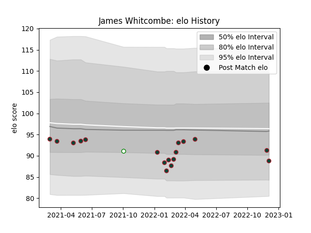

---  
layout: page  
title: James Whitcombe  
date: 2022-12-09 13:07:03.641451  
categories: player  
---
# James Whitcombe

## Positions: P

## Current elo: 89.0

## Current Percentile: 28.0

# Elo History

# Match History

| Team             |   Appearances |   Win Rate |
|:-----------------|--------------:|-----------:|
| Leicester Tigers |            17 |   0.617647 |
| Nottingham       |             1 |   1        |

| Opponent           |   Matches |   Win Rate |
|:-------------------|----------:|-----------:|
| Bristol Rugby      |         3 |        0.5 |
| Exeter Chiefs      |         2 |        0.5 |
| London Irish       |         2 |        1   |
| Sale Sharks        |         2 |        0   |
| Wasps              |         2 |        0.5 |
| Worcester Warriors |         2 |        1   |
| Bath Rugby         |         1 |        1   |
| Gloucester Rugby   |         1 |        1   |
| Hartpury College   |         1 |        1   |
| Northampton Saints |         1 |        1   |
| Saracens           |         1 |        0   |