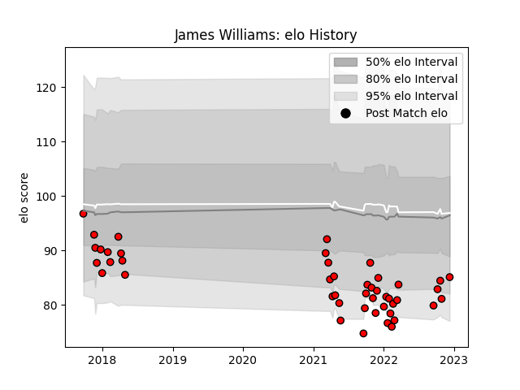

---  
layout: page  
title: James Williams  
date: 2022-12-18 16:22:04.370817  
categories: player  
---
# James Williams

## Positions: FH, C

## Current elo: 85.0

## Current Percentile: 8.0

# Elo History

# Match History

| Team             |   Appearances |   Win Rate |
|:-----------------|--------------:|-----------:|
| Hartpury College |            46 |   0.304348 |

| Opponent            |   Matches |   Win Rate |
|:--------------------|----------:|-----------:|
| Bedford             |         6 |   0.166667 |
| Ealing Trailfinders |         5 |   0        |
| Jersey              |         5 |   0        |
| Nottingham          |         5 |   0.8      |
| Richmond            |         5 |   0.4      |
| Coventry            |         4 |   0.5      |
| Doncaster           |         4 |   0        |
| Ampthill            |         3 |   0.333333 |
| Cornish Pirates     |         3 |   0.333333 |
| London Scottish     |         2 |   0.75     |
| Yorkshire Carnegie  |         2 |   0.25     |
| Bristol Rugby       |         1 |   0        |
| Rotherham Titans    |         1 |   1        |