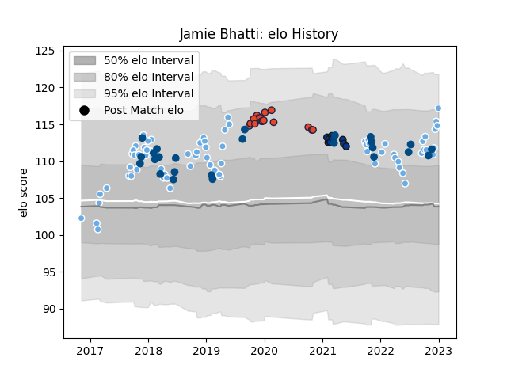

---  
layout: page  
title: Jamie Bhatti  
date: 2022-12-09 13:11:00.868728  
categories: player  
---
# Jamie Bhatti

## Positions: P

## Country: Scotland

## Current elo: 107.0

## Current Percentile: 84.0

# Elo History

# Match History

| Team             |   Appearances |   Win Rate |
|:-----------------|--------------:|-----------:|
| Glasgow Warriors |            68 |   0.529412 |
| Scotland         |            24 |   0.625    |
| Edinburgh        |            14 |   0.678571 |
| Bath Rugby       |             9 |   0.333333 |

| Opponent                 |   Matches |   Win Rate |
|:-------------------------|----------:|-----------:|
| Leinster                 |         8 |   0.25     |
| Edinburgh                |         7 |   0.285714 |
| Scarlets                 |         7 |   0.428571 |
| Ospreys                  |         7 |   0.571429 |
| Cardiff Blues            |         7 |   0.857143 |
| Zebre                    |         5 |   1        |
| Benetton Treviso         |         5 |   0.2      |
| Connacht                 |         5 |   0.8      |
| Ulster                   |         4 |   0.5      |
| Munster                  |         3 |   0.666667 |
| Argentina                |         3 |   1        |
| Ireland                  |         3 |   0        |
| Exeter Chiefs            |         3 |   0.333333 |
| Italy                    |         3 |   1        |
| Australia                |         3 |   0.666667 |
| France                   |         2 |   0.5      |
| Wasps                    |         2 |   1        |
| Glasgow Warriors         |         2 |   0.5      |
| Sale Sharks              |         2 |   0.5      |
| Harlequins               |         2 |   0        |
| Bristol Rugby            |         2 |   0        |
| Cheetahs                 |         2 |   1        |
| Sharks                   |         2 |   0.5      |
| Southern Kings           |         2 |   0.5      |
| Lyon                     |         2 |   1        |
| Montpellier Herault      |         2 |   0        |
| Bulls                    |         2 |   0.5      |
| England                  |         1 |   1        |
| South Africa             |         1 |   0        |
| Stormers                 |         1 |   0        |
| Saracens                 |         1 |   0        |
| United States of America |         1 |   0        |
| Wales                    |         1 |   0        |
| Bordeaux Begles          |         1 |   0.5      |
| New Zealand              |         1 |   0        |
| Samoa                    |         1 |   1        |
| Northampton Saints       |         1 |   1        |
| Dragons                  |         1 |   1        |
| Lions                    |         1 |   1        |
| Canada                   |         1 |   1        |
| Japan                    |         1 |   1        |
| Chile                    |         1 |   1        |
| Gloucester Rugby         |         1 |   1        |
| Georgia                  |         1 |   1        |
| Agen                     |         1 |   1        |