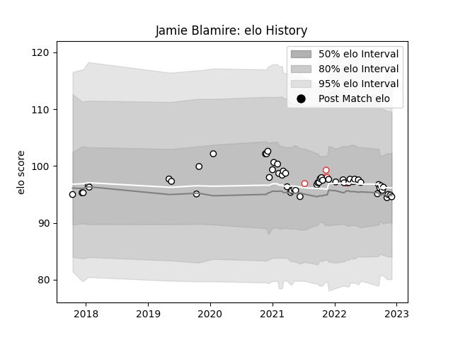

---  
layout: page  
title: Jamie Blamire  
date: 2022-12-18 16:30:16.078064  
categories: player  
---
# Jamie Blamire

## Positions: H, FL

## Country: England

## Current elo: 94.0

## Current Percentile: 47.0

# Elo History

# Match History

| Team              |   Appearances |   Win Rate |
|:------------------|--------------:|-----------:|
| Newcastle Falcons |            54 |   0.416667 |
| England           |             5 |   0.8      |

| Opponent           |   Matches |   Win Rate |
|:-------------------|----------:|-----------:|
| Bristol Rugby      |         5 |   0.4      |
| Gloucester Rugby   |         5 |   0.4      |
| Northampton Saints |         4 |   0.25     |
| Harlequins         |         4 |   0.25     |
| Wasps              |         4 |   0.5      |
| London Irish       |         4 |   0.25     |
| Bath Rugby         |         4 |   0.5      |
| Worcester Warriors |         3 |   0.5      |
| Sale Sharks        |         3 |   0.333333 |
| Leicester Tigers   |         3 |   0        |
| Exeter Chiefs      |         3 |   0.333333 |
| Dragons            |         2 |   1        |
| RC Enisei          |         2 |   1        |
| Saracens           |         2 |   0        |
| South Africa       |         1 |   1        |
| Tonga              |         1 |   1        |
| Australia          |         1 |   1        |
| Ireland            |         1 |   0        |
| London Scottish    |         1 |   1        |
| Cornish Pirates    |         1 |   1        |
| Connacht           |         1 |   0        |
| Cardiff Blues      |         1 |   0        |
| Canada             |         1 |   1        |
| Bordeaux Begles    |         1 |   1        |
| Yorkshire Carnegie |         1 |   1        |