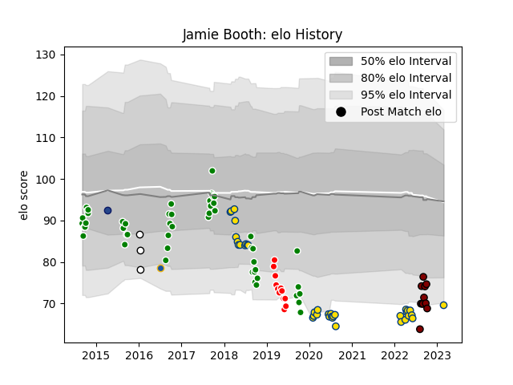

---  
layout: page  
title: Jamie Booth  
date: 2023-03-02 11:25:01.411731  
categories: player  
---
# Jamie Booth

## Positions: SH

## Current elo: 70.0

## Current Percentile: 4.0

# Elo History

# Match History

| Team              |   Appearances |   Win Rate |
|:------------------|--------------:|-----------:|
| Manawatu          |            50 |  0.46      |
| Hurricanes        |            36 |  0.611111  |
| Sunwolves         |            12 |  0.0833333 |
| North Harbour     |            11 |  0.545455  |
| Newcastle Falcons |             3 |  0         |
| Blues             |             1 |  1         |
| Highlanders       |             1 |  1         |

| Opponent                 |   Matches |   Win Rate |
|:-------------------------|----------:|-----------:|
| Bay of Plenty            |         7 |   0.285714 |
| Southland                |         7 |   0.857143 |
| Chiefs                   |         7 |   0.857143 |
| Blues                    |         6 |   0.5      |
| Brumbies                 |         6 |   0.166667 |
| Hawke's Bay              |         6 |   0.5      |
| Crusaders                |         5 |   0.2      |
| Queensland Reds          |         5 |   0.6      |
| Waikato                  |         5 |   0.6      |
| Counties Manukau         |         5 |   0.6      |
| Canterbury               |         5 |   0.4      |
| North Harbour            |         4 |   0.25     |
| Taranaki                 |         4 |   0.25     |
| Otago                    |         4 |   0.25     |
| Northland                |         4 |   0.75     |
| Tasman                   |         3 |   0.666667 |
| Wellington               |         3 |   0.333333 |
| Auckland                 |         3 |   0        |
| Melbourne Rebels         |         3 |   0.333333 |
| Jaguares                 |         3 |   0.666667 |
| Highlanders              |         3 |   0.666667 |
| Lions                    |         2 |   0.5      |
| Sharks                   |         2 |   1        |
| Stormers                 |         2 |   0        |
| New South Wales Waratahs |         1 |   1        |
| Manawatu                 |         1 |   1        |
| London Irish             |         1 |   0        |
| RC Enisei                |         1 |   0        |
| Southern Kings           |         1 |   1        |
| Sunwolves                |         1 |   1        |
| Hurricanes               |         1 |   0        |
| Enisey-STM Krasnoyarsk   |         1 |   0        |
| Bulls                    |         1 |   0        |
| Western Force            |         1 |   0        |