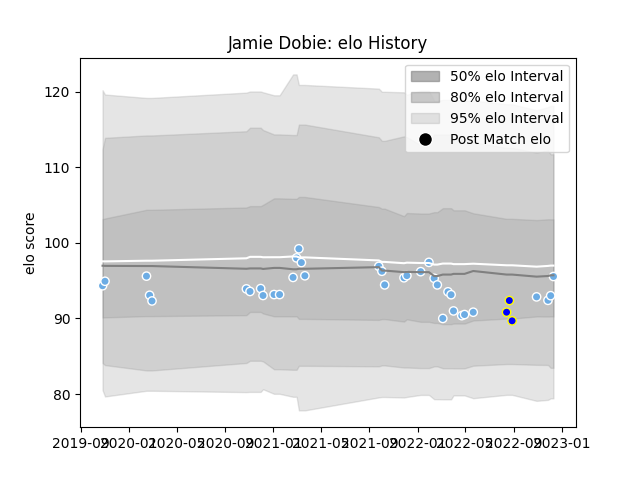

---  
layout: page  
title: Jamie Dobie  
date: 2023-02-02 18:44:26.140343  
categories: player  
---
# Jamie Dobie

## Positions: SH

## Country: Scotland

## Current elo: 93.0

## Current Percentile: 40.0

# Elo History

# Match History

| Team             |   Appearances |   Win Rate |
|:-----------------|--------------:|-----------:|
| Glasgow Warriors |            38 |   0.552632 |
| Bay of Plenty    |             3 |   0.666667 |
| Scotland         |             1 |   1        |

| Opponent         |   Matches |   Win Rate |
|:-----------------|----------:|-----------:|
| Dragons          |         6 |   0.5      |
| Zebre            |         4 |   1        |
| Edinburgh        |         4 |   0.5      |
| Leinster         |         4 |   0        |
| Benetton Treviso |         3 |   0.666667 |
| Ospreys          |         3 |   0.666667 |
| Ulster           |         2 |   0        |
| Cardiff Blues    |         2 |   0.5      |
| Scarlets         |         1 |   0        |
| Tonga            |         1 |   1        |
| Taranaki         |         1 |   1        |
| Stormers         |         1 |   0        |
| Southern Kings   |         1 |   1        |
| Sharks           |         1 |   1        |
| Auckland         |         1 |   1        |
| Perpignan        |         1 |   1        |
| Bath Rugby       |         1 |   1        |
| Lions            |         1 |   1        |
| Counties Manukau |         1 |   0        |
| Connacht         |         1 |   1        |
| Bulls            |         1 |   0        |
| Munster          |         1 |   1        |