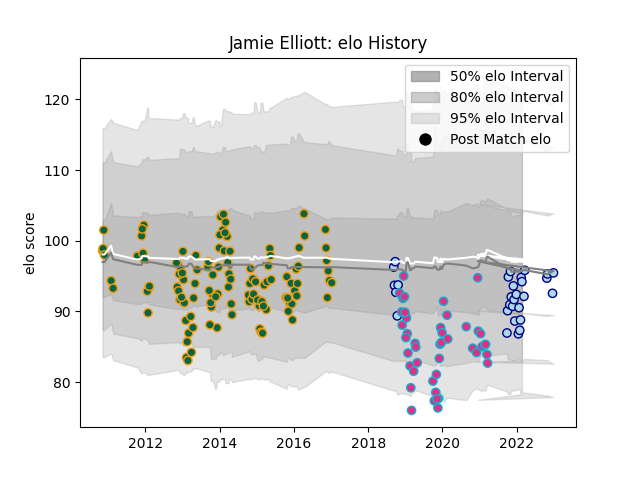

---  
layout: page  
title: Jamie Elliott  
date: 2022-12-28 12:56:43.795975  
categories: player  
---
# Jamie Elliott

## Positions: W, C

## Current elo: 94.0

## Current Percentile: 47.0

# Elo History

# Match History

| Team               |   Appearances |   Win Rate |
|:-------------------|--------------:|-----------:|
| Northampton Saints |           116 |   0.573276 |
| Zebre              |            44 |   0.215909 |
| Bedford            |            29 |   0.448276 |

| Opponent             |   Matches |   Win Rate |
|:---------------------|----------:|-----------:|
| Saracens             |        14 |   0.535714 |
| Leicester Tigers     |        12 |   0.125    |
| Sale Sharks          |         9 |   0.666667 |
| Benetton Treviso     |         8 |   0.375    |
| Bath Rugby           |         8 |   0.6875   |
| Harlequins           |         8 |   0.625    |
| Leinster             |         7 |   0.142857 |
| London Irish         |         7 |   0.714286 |
| Exeter Chiefs        |         7 |   0.428571 |
| Newcastle Falcons    |         7 |   0.714286 |
| Ospreys              |         6 |   0.666667 |
| Gloucester Rugby     |         6 |   0.416667 |
| Munster              |         5 |   0        |
| Glasgow Warriors     |         5 |   0.2      |
| Ulster               |         5 |   0.2      |
| Wasps                |         5 |   0.8      |
| Racing 92            |         4 |   0.125    |
| Dragons              |         4 |   1        |
| London Welsh         |         4 |   1        |
| Castres Olympique    |         4 |   0.5      |
| Jersey               |         4 |   0.5      |
| Worcester Warriors   |         4 |   0.75     |
| Richmond             |         3 |   0        |
| London Scottish      |         3 |   0.666667 |
| Scarlets             |         3 |   0.333333 |
| Ampthill             |         3 |   0.666667 |
| Hartpury College     |         3 |   0.666667 |
| Doncaster            |         3 |   0.666667 |
| Coventry             |         3 |   0        |
| Cornish Pirates      |         3 |   0.333333 |
| Brive                |         3 |   0.666667 |
| Cheetahs             |         2 |   0        |
| Bristol Rugby        |         2 |   0.5      |
| Stade Francais Paris |         2 |   0.5      |
| La Rochelle          |         2 |   0        |
| Edinburgh            |         2 |   0        |
| RC Enisei            |         2 |   1        |
| Ealing Trailfinders  |         2 |   0.5      |
| Clermont Auvergne    |         1 |   0        |
| Cardiff Blues        |         1 |   0        |
| Nottingham           |         1 |   1        |
| Bayonne              |         1 |   0.5      |
| Connacht             |         1 |   0        |