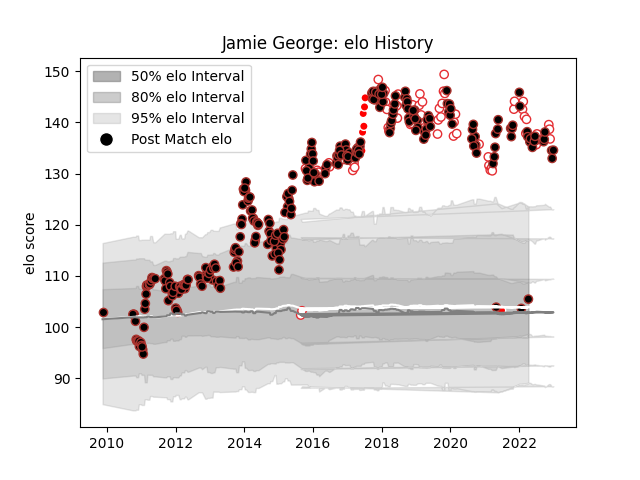

---  
layout: page  
title: Jamie George  
date: 2022-11-22 11:37:20.669950  
categories: player  
---
# Jamie George

## Positions: H

## Country: England

## Current elo: 140.0

## Current Percentile: 99.0

# Elo History

# Match History

| Team                    |   Appearances |   Win Rate |
|:------------------------|--------------:|-----------:|
| Saracens                |           273 |   0.763736 |
| England                 |            65 |   0.707692 |
| British and Irish Lions |             6 |   0.75     |

| Opponent            |   Matches |   Win Rate |
|:--------------------|----------:|-----------:|
| Northampton Saints  |        23 |   0.586957 |
| Exeter Chiefs       |        20 |   0.625    |
| Wasps               |        19 |   0.842105 |
| Sale Sharks         |        19 |   0.789474 |
| Harlequins          |        19 |   0.789474 |
| Leicester Tigers    |        18 |   0.694444 |
| Gloucester Rugby    |        18 |   0.694444 |
| Bath Rugby          |        16 |   0.90625  |
| Worcester Warriors  |        15 |   0.866667 |
| London Irish        |        13 |   0.846154 |
| Newcastle Falcons   |        12 |   1        |
| Clermont Auvergne   |        10 |   0.3      |
| Australia           |        10 |   0.9      |
| Italy               |         8 |   1        |
| Ireland             |         8 |   0.5      |
| Bristol Rugby       |         7 |   0.714286 |
| Scotland            |         7 |   0.5      |
| Wales               |         7 |   0.571429 |
| New Zealand         |         6 |   0.5      |
| Racing 92           |         6 |   0.666667 |
| France              |         6 |   0.5      |
| South Africa        |         6 |   0.5      |
| Leinster            |         5 |   0.4      |
| Munster             |         5 |   0.8      |
| Scarlets            |         4 |   0.875    |
| Glasgow Warriors    |         4 |   1        |
| Ospreys             |         4 |   0.875    |
| London Welsh        |         4 |   1        |
| Stade Toulousain    |         4 |   0.5      |
| Cardiff Blues       |         3 |   1        |
| Toulon              |         3 |   0.666667 |
| Argentina           |         3 |   1        |
| Ulster              |         3 |   1        |
| Oyonnax             |         2 |   1        |
| Tonga               |         2 |   1        |
| Zebre               |         2 |   1        |
| Lyon                |         2 |   1        |
| Japan               |         2 |   1        |
| Biarritz Olympique  |         2 |   0.5      |
| Connacht            |         2 |   1        |
| New Zealand Maori   |         1 |   1        |
| Coventry            |         1 |   1        |
| Yorkshire Carnegie  |         1 |   1        |
| Bedford             |         1 |   1        |
| Benetton Treviso    |         1 |   1        |
| Uruguay             |         1 |   1        |
| Doncaster           |         1 |   1        |
| Crusaders           |         1 |   1        |
| Provincial Union XV |         1 |   1        |
| Ealing Trailfinders |         1 |   1        |
| Fiji                |         1 |   1        |
| Samoa               |         1 |   1        |
| Leeds               |         1 |   1        |
| Richmond            |         1 |   1        |
| Ampthill            |         1 |   1        |