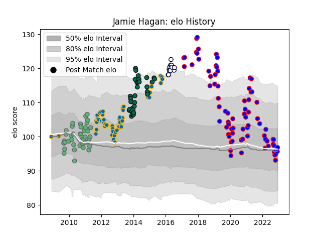

---  
layout: page  
title: Jamie Hagan  
date: 2022-12-18 16:24:05.190324  
categories: player  
---
# Jamie Hagan

## Positions: P

## Current elo: 96.0

## Current Percentile: 46.0

# Elo History

# Match History

| Team             |   Appearances |   Win Rate |
|:-----------------|--------------:|-----------:|
| Beziers          |            77 |   0.519481 |
| Leinster         |            57 |   0.745614 |
| Connacht         |            40 |   0.325    |
| London Irish     |            33 |   0.393939 |
| Melbourne Rebels |            12 |   0.416667 |
| Edinburgh        |             1 |   0        |

| Opponent                   |   Matches |   Win Rate |
|:---------------------------|----------:|-----------:|
| Dragons                    |        12 |   0.666667 |
| Scarlets                   |        10 |   0.7      |
| Glasgow Warriors           |         9 |   0.666667 |
| Munster                    |         9 |   0.333333 |
| Ospreys                    |         9 |   0.222222 |
| Cardiff Blues              |         8 |   0.75     |
| Mont-de-Marsan             |         8 |   0.375    |
| Ulster                     |         8 |   0.3125   |
| Colomiers                  |         7 |   0.428571 |
| Benetton Treviso           |         7 |   0.785714 |
| Wasps                      |         6 |   0.416667 |
| Carcassonne                |         6 |   0.333333 |
| Biarritz Olympique         |         6 |   0.666667 |
| Grenoble                   |         6 |   0.333333 |
| Edinburgh                  |         6 |   0.5      |
| Soyaux-Angouleme           |         5 |   0.2      |
| Montauban                  |         5 |   1        |
| Vannes                     |         5 |   0.6      |
| Aurillac                   |         4 |   0.75     |
| Sale Sharks                |         4 |   0.5      |
| Provence Rugby             |         4 |   0.75     |
| Nevers                     |         4 |   0        |
| Aironi                     |         4 |   0.75     |
| Connacht                   |         3 |   0.666667 |
| Stade Francais Paris       |         3 |   0.666667 |
| Newcastle Falcons          |         3 |   0.333333 |
| Northampton Saints         |         3 |   0        |
| Harlequins                 |         3 |   0.333333 |
| Bath Rugby                 |         3 |   0        |
| Leicester Tigers           |         3 |   0        |
| Leinster                   |         3 |   0        |
| Oyonnax                    |         3 |   0        |
| Massy                      |         2 |   1        |
| Perpignan                  |         2 |   0.5      |
| Agen                       |         2 |   1        |
| Gloucester Rugby           |         2 |   0        |
| Rouen                      |         2 |   1        |
| Dax                        |         2 |   1        |
| Bayonne                    |         2 |   0.5      |
| Saracens                   |         1 |   1        |
| Sunwolves                  |         1 |   1        |
| Rovigo                     |         1 |   1        |
| Toulon                     |         1 |   0        |
| US Bressane                |         1 |   0        |
| Valence Romans Drome Rugby |         1 |   1        |
| Western Force              |         1 |   1        |
| Worcester Warriors         |         1 |   1        |
| Roval Drome XV             |         1 |   1        |
| Lusitanos XV               |         1 |   1        |
| Queensland Reds            |         1 |   1        |
| Cheetahs                   |         1 |   1        |
| Blues                      |         1 |   0        |
| Brive                      |         1 |   1        |
| Brumbies                   |         1 |   0        |
| Bulls                      |         1 |   0        |
| Castres Olympique          |         1 |   1        |
| Cavalieri Prato            |         1 |   1        |
| Chiefs                     |         1 |   0        |
| New South Wales Waratahs   |         1 |   1        |
| Crusaders                  |         1 |   0        |
| Exeter Chiefs              |         1 |   1        |
| Highlanders                |         1 |   0        |
| Hurricanes                 |         1 |   0        |
| London Welsh               |         1 |   1        |
| Montpellier Herault        |         1 |   1        |
| Zebre                      |         1 |   1        |