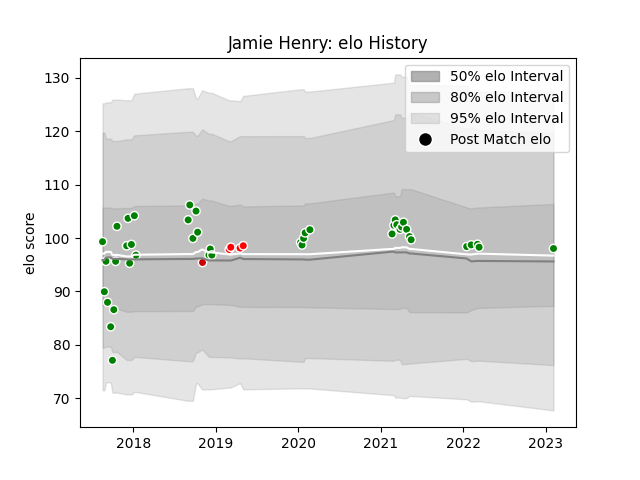

---  
layout: page  
title: Jamie Henry  
date: 2023-02-04 18:29:58.009973  
categories: player  
---
# Jamie Henry

## Positions: W

## Country: Japan

## Current elo: 98.0

## Current Percentile: None

# Elo History

# Match History

| Team            |   Appearances |   Win Rate |
|:----------------|--------------:|-----------:|
| Toyota Verblitz |            43 |   0.639535 |
| Sunwolves       |             4 |   0.25     |
| Japan           |             1 |   0        |

| Opponent                          |   Matches |   Win Rate |
|:----------------------------------|----------:|-----------:|
| Saitama Wild Knights              |         6 |   0.166667 |
| Urayasu D-Rocks                   |         4 |   1        |
| Tokyo Sungoliath                  |         4 |   0        |
| Shizuoka Blue Revs                |         4 |   0        |
| Kubota Spears Funabashi Tokyo-Bay |         4 |   0.75     |
| Kobelco Kobe Steelers             |         3 |   0.5      |
| Black Rams Tokyo                  |         2 |   1        |
| Toshiba Brave Lupus Tokyo         |         2 |   1        |
| Hino Red Dolphins                 |         2 |   1        |
| Mie Honda Heat                    |         2 |   1        |
| Munakata Sanix Blues              |         2 |   1        |
| NTT Docomo Red Hurricanes Osaka   |         2 |   1        |
| Queensland Reds                   |         1 |   0        |
| Toyota Industries Shuttles Aichi  |         1 |   1        |
| Mitsubishi Dynaboars              |         1 |   1        |
| New Zealand                       |         1 |   0        |
| Blues                             |         1 |   0        |
| Hurricanes                        |         1 |   0        |
| Hanazono Kintetsu Liners          |         1 |   1        |
| Green Rockets Tokatsu             |         1 |   1        |
| Coca-Cola Red Sparks              |         1 |   1        |
| Chiefs                            |         1 |   1        |
| Yokohama Canon Eagles             |         1 |   1        |