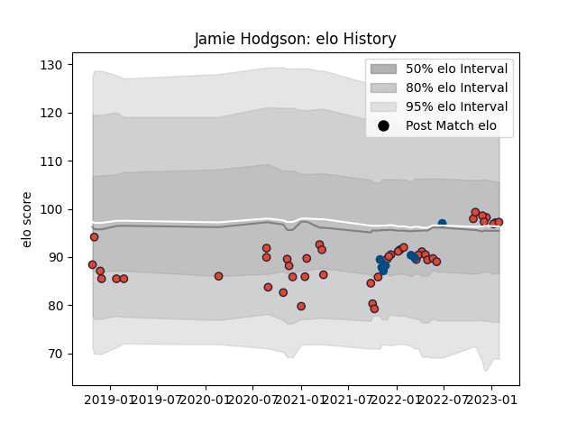

---  
layout: page  
title: Jamie Hodgson  
date: 2023-02-02 19:12:46.540160  
categories: player  
---
# Jamie Hodgson

## Positions: L

## Country: Scotland

## Current elo: 97.0

## Current Percentile: 53.0

# Elo History

# Match History

| Team      |   Appearances |   Win Rate |
|:----------|--------------:|-----------:|
| Edinburgh |            45 |   0.5      |
| Scotland  |             7 |   0.714286 |

| Opponent          |   Matches |   Win Rate |
|:------------------|----------:|-----------:|
| Glasgow Warriors  |         7 |   0.571429 |
| Zebre             |         6 |   0.833333 |
| Cardiff Blues     |         5 |   0.6      |
| Connacht          |         3 |   0.666667 |
| Dragons           |         3 |   0.333333 |
| Benetton Treviso  |         3 |   0.333333 |
| Saracens          |         2 |   0.5      |
| Ulster            |         2 |   0        |
| Stormers          |         2 |   0.25     |
| Sharks            |         2 |   0.5      |
| Munster           |         2 |   0        |
| Scarlets          |         2 |   1        |
| Tonga             |         1 |   1        |
| Southern Kings    |         1 |   0        |
| South Africa      |         1 |   0        |
| Australia         |         1 |   1        |
| Pau               |         1 |   1        |
| Ospreys           |         1 |   0        |
| Leinster          |         1 |   0        |
| Japan             |         1 |   1        |
| Italy             |         1 |   1        |
| France            |         1 |   0        |
| Chile             |         1 |   1        |
| Castres Olympique |         1 |   1        |
| London Irish      |         1 |   0        |