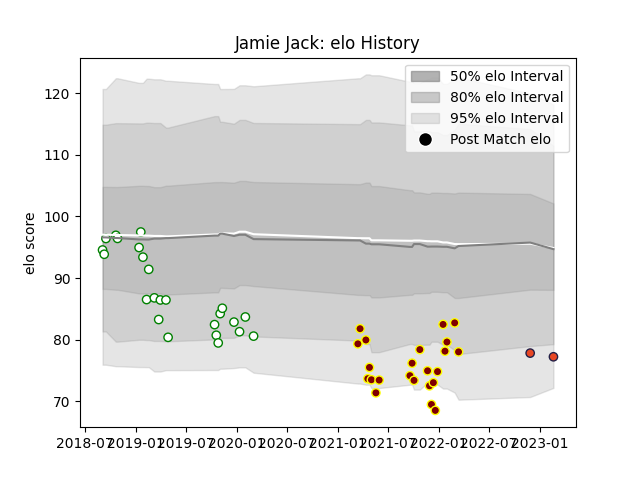

---  
layout: page  
title: Jamie Jack  
date: 2023-02-24 02:33:24.513608  
categories: player  
---
# Jamie Jack

## Positions: P

## Current elo: 77.0

## Current Percentile: 8.0

# Elo History

# Match History

| Team       |   Appearances |   Win Rate |
|:-----------|--------------:|-----------:|
| Nottingham |            24 |   0.333333 |
| Ampthill   |            23 |   0.413043 |
| Edinburgh  |             2 |   0        |

| Opponent            |   Matches |   Win Rate |
|:--------------------|----------:|-----------:|
| Ealing Trailfinders |         6 |   0.166667 |
| Jersey              |         6 |   0.25     |
| Hartpury College    |         5 |   0.4      |
| Bedford             |         4 |   0.25     |
| Cornish Pirates     |         4 |   0.25     |
| Coventry            |         4 |   0.25     |
| London Scottish     |         4 |   0.75     |
| Nottingham          |         3 |   0.666667 |
| Richmond            |         3 |   0.666667 |
| Doncaster           |         2 |   0.5      |
| London Irish        |         2 |   0        |
| Yorkshire Carnegie  |         2 |   0.5      |
| Ampthill            |         1 |   1        |
| Benetton Treviso    |         1 |   0        |
| Saracens            |         1 |   0        |
| Scarlets            |         1 |   0        |