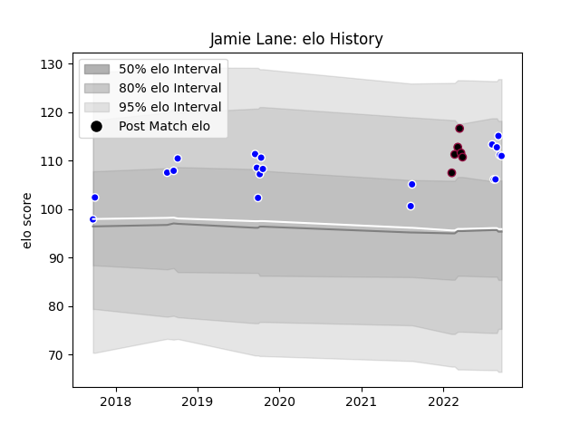

---  
layout: page  
title: Jamie Lane  
date: 2023-03-21 18:16:46.396678  
categories: player  
---
# Jamie Lane

Last updated: 2023-03-21
## Positions: L

## Current elo: 111.0

## Current Percentile: 82.0

# Elo History

# Match History

| Team          |   Appearances |   Win Rate |
|:--------------|--------------:|-----------:|
| Auckland      |            20 |   0.6      |
| Utah Warriors |             6 |   0.333333 |

| Opponent          |   Matches |   Win Rate |
|:------------------|----------:|-----------:|
| Tasman            |         4 |       0.25 |
| Wellington        |         2 |       0.5  |
| Southland         |         2 |       1    |
| Canterbury        |         2 |       1    |
| Counties Manukau  |         2 |       1    |
| Bay of Plenty     |         2 |       0.5  |
| Otago             |         2 |       0.5  |
| Waikato           |         1 |       0    |
| Toronto Arrows    |         1 |       0    |
| Taranaki          |         1 |       1    |
| Austin Gilgronis  |         1 |       0    |
| San Diego Legion  |         1 |       0    |
| North Harbour     |         1 |       1    |
| L. A. Giltinis    |         1 |       1    |
| Houston SaberCats |         1 |       0    |
| Dallas Jackals    |         1 |       1    |
| Northland         |         1 |       0    |