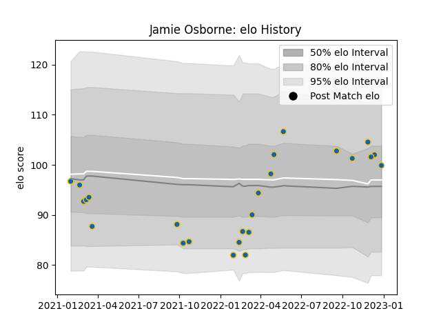

---  
layout: page  
title: Jamie Osborne  
date: 2022-12-18 16:38:46.099570  
categories: player  
---
# Jamie Osborne

## Positions: C, FB

## Current elo: 102.0

## Current Percentile: 68.0

# Elo History

# Match History

| Team     |   Appearances |   Win Rate |
|:---------|--------------:|-----------:|
| Leinster |            24 |   0.791667 |

| Opponent         |   Matches |   Win Rate |
|:-----------------|----------:|-----------:|
| Glasgow Warriors |         3 |   1        |
| Ulster           |         3 |   0.666667 |
| Zebre            |         3 |   1        |
| Munster          |         2 |   1        |
| Ospreys          |         2 |   0.5      |
| Benetton Treviso |         1 |   1        |
| Bulls            |         1 |   1        |
| Cardiff Blues    |         1 |   0        |
| Connacht         |         1 |   1        |
| Dragons          |         1 |   1        |
| Edinburgh        |         1 |   1        |
| Lions            |         1 |   1        |
| Racing 92        |         1 |   1        |
| Scarlets         |         1 |   1        |
| Sharks           |         1 |   0        |
| Stormers         |         1 |   0        |