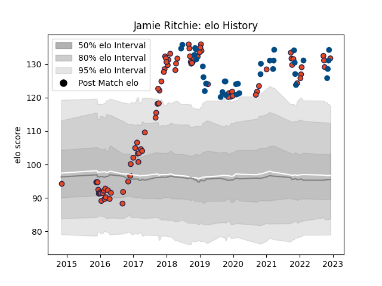

---  
layout: page  
title: Jamie Ritchie  
date: 2022-11-16 11:34:00.053563  
categories: player  
---
# Jamie Ritchie

## Positions: FL

## Country: Scotland

## Current elo: 129.0

## Current Percentile: 97.0

# Elo History

# Match History

| Team      |   Appearances |   Win Rate |
|:----------|--------------:|-----------:|
| Edinburgh |            85 |   0.570588 |
| Scotland  |            33 |   0.606061 |

| Opponent             |   Matches |   Win Rate |
|:---------------------|----------:|-----------:|
| Glasgow Warriors     |        10 |   0.8      |
| Scarlets             |         7 |   0.571429 |
| Leinster             |         6 |   0.166667 |
| Ulster               |         6 |   0.166667 |
| Dragons              |         6 |   0.833333 |
| Ospreys              |         5 |   0.2      |
| Cardiff Blues        |         5 |   0.4      |
| London Irish         |         5 |   0.6      |
| France               |         4 |   0.5      |
| Benetton Treviso     |         4 |   0.75     |
| Wales                |         3 |   0.333333 |
| Munster              |         3 |   0        |
| Italy                |         3 |   1        |
| Ireland              |         3 |   0        |
| Agen                 |         3 |   1        |
| Zebre                |         3 |   1        |
| England              |         3 |   0.666667 |
| Connacht             |         3 |   0.333333 |
| Fiji                 |         2 |   1        |
| Wasps                |         2 |   1        |
| Australia            |         2 |   0.5      |
| Toulon               |         2 |   1        |
| Stormers             |         2 |   0.25     |
| Stade Francais Paris |         2 |   0.5      |
| Southern Kings       |         2 |   1        |
| South Africa         |         2 |   0        |
| Georgia              |         2 |   1        |
| Montpellier Herault  |         2 |   0.5      |
| Argentina            |         2 |   1        |
| Japan                |         2 |   0.5      |
| Bulls                |         1 |   0        |
| Newcastle Falcons    |         1 |   1        |
| Samoa                |         1 |   1        |
| Brive                |         1 |   1        |
| New Zealand          |         1 |   0        |
| Canada               |         1 |   1        |
| Cheetahs             |         1 |   1        |
| Timisoara Saracens   |         1 |   1        |
| Tonga                |         1 |   1        |
| Bordeaux Begles      |         1 |   0        |
| Krasny Yar           |         1 |   1        |
| Russia               |         1 |   1        |