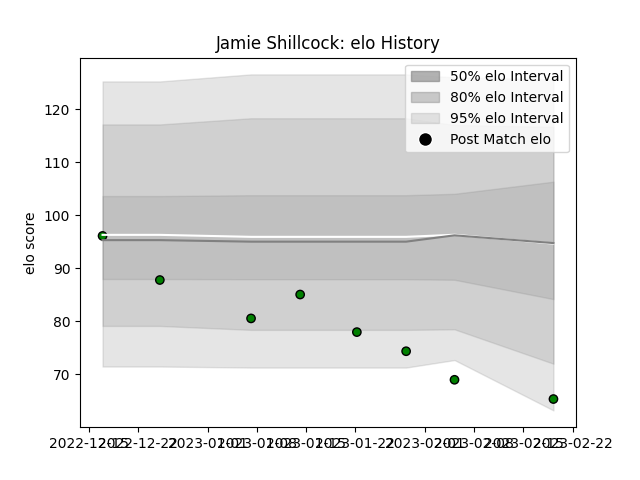

---  
layout: page  
title: Jamie Shillcock  
date: 2023-02-24 02:33:10.878712  
categories: player  
---
# Jamie Shillcock

## Positions: FH, FB

## Current elo: 65.0

## Current Percentile: 3.0

# Elo History

# Match History

| Team                 |   Appearances |   Win Rate |
|:---------------------|--------------:|-----------:|
| Mitsubishi Dynaboars |             8 |     0.4375 |

| Opponent                          |   Matches |   Win Rate |
|:----------------------------------|----------:|-----------:|
| Black Rams Tokyo                  |         1 |        1   |
| Kobelco Kobe Steelers             |         1 |        0   |
| Kubota Spears Funabashi Tokyo-Bay |         1 |        0   |
| Saitama Wild Knights              |         1 |        0   |
| Shizuoka Blue Revs                |         1 |        0.5 |
| Tokyo Sungoliath                  |         1 |        0   |
| Toshiba Brave Lupus Tokyo         |         1 |        1   |
| Toyota Verblitz                   |         1 |        1   |