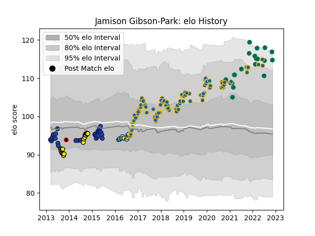

---  
layout: page  
title: Jamison Gibson-Park  
date: 2022-11-22 11:41:41.658027  
categories: player  
---
# Jamison Gibson-Park

## Positions: SH

## Country: Ireland

## Current elo: 117.0

## Current Percentile: 93.0

# Elo History

# Match History

| Team              |   Appearances |   Win Rate |
|:------------------|--------------:|-----------:|
| Leinster          |           101 |   0.826733 |
| Blues             |            34 |   0.205882 |
| Ireland           |            21 |   0.761905 |
| Taranaki          |            20 |   0.525    |
| Hurricanes        |            15 |   0.8      |
| New Zealand Maori |             1 |   1        |

| Opponent                 |   Matches |   Win Rate |
|:-------------------------|----------:|-----------:|
| Ulster                   |        10 |   0.9      |
| Glasgow Warriors         |         9 |   0.666667 |
| Munster                  |         9 |   0.888889 |
| Dragons                  |         8 |   1        |
| Benetton Treviso         |         8 |   0.875    |
| Scarlets                 |         7 |   0.571429 |
| Highlanders              |         6 |   0.333333 |
| Chiefs                   |         6 |   0.166667 |
| Connacht                 |         5 |   0.8      |
| Crusaders                |         5 |   0.2      |
| Edinburgh                |         5 |   0.8      |
| Zebre                    |         5 |   1        |
| Ospreys                  |         4 |   0.75     |
| Northampton Saints       |         4 |   1        |
| New Zealand              |         4 |   0.75     |
| Cheetahs                 |         4 |   0.25     |
| Bulls                    |         4 |   0.5      |
| Sharks                   |         4 |   0.25     |
| Montpellier Herault      |         4 |   0.75     |
| Hurricanes               |         4 |   0.25     |
| New South Wales Waratahs |         3 |   0.333333 |
| Tasman                   |         3 |   0.666667 |
| Melbourne Rebels         |         3 |   0.666667 |
| Italy                    |         3 |   1        |
| Auckland                 |         3 |   0.666667 |
| Lions                    |         3 |   0.666667 |
| Brumbies                 |         3 |   0.333333 |
| Cardiff Blues            |         3 |   1        |
| France                   |         3 |   0        |
| Canterbury               |         2 |   0        |
| Western Force            |         2 |   1        |
| Wellington               |         2 |   0.5      |
| Wasps                    |         2 |   1        |
| Wales                    |         2 |   0.5      |
| Bath Rugby               |         2 |   1        |
| Stormers                 |         2 |   0.5      |
| Southland                |         2 |   1        |
| Southern Kings           |         2 |   1        |
| Blues                    |         2 |   1        |
| Scotland                 |         2 |   1        |
| Hawke's Bay              |         2 |   0.5      |
| Lyon                     |         2 |   1        |
| Castres Olympique        |         2 |   0.75     |
| Counties Manukau         |         2 |   0.25     |
| Japan                    |         2 |   1        |
| England                  |         2 |   1        |
| Exeter Chiefs            |         2 |   1        |
| Queensland Reds          |         1 |   0        |
| Fiji                     |         1 |   1        |
| Jaguares                 |         1 |   1        |
| Australia                |         1 |   1        |
| Waikato                  |         1 |   0        |
| United States of America |         1 |   1        |
| Manawatu                 |         1 |   0        |
| Bay of Plenty            |         1 |   1        |
| Racing 92                |         1 |   1        |
| Stade Toulousain         |         1 |   1        |
| South Africa             |         1 |   1        |
| Clermont Auvergne        |         1 |   0        |
| Northland                |         1 |   1        |
| Saracens                 |         1 |   0        |