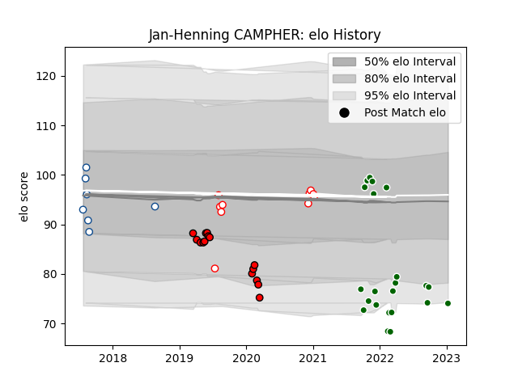

---  
layout: page  
title: Jan-Henning CAMPHER  
date: 2023-01-27 19:00:54.608503  
categories: player  
---
# Jan-Henning CAMPHER

## Positions: H

## Current elo: 69.0

## Current Percentile: 2.0

# Elo History

# Match History

| Team                |   Appearances |   Win Rate |
|:--------------------|--------------:|-----------:|
| Ealing Trailfinders |            24 |   0.791667 |
| Lions               |            15 |   0.333333 |
| Golden Lions        |            10 |   0.7      |
| Blue Bulls          |             7 |   0.428571 |

| Opponent                 |   Matches |   Win Rate |
|:-------------------------|----------:|-----------:|
| Ampthill                 |         4 |   1        |
| Free State Cheetahs      |         4 |   0.75     |
| Hartpury College         |         4 |   1        |
| Pumas                    |         3 |   0.666667 |
| Natal Sharks             |         3 |   0.333333 |
| Doncaster                |         3 |   0.333333 |
| Bedford                  |         2 |   0.5      |
| Stormers                 |         2 |   0.5      |
| Sharks                   |         2 |   0        |
| Richmond                 |         2 |   1        |
| New South Wales Waratahs |         2 |   0.5      |
| Melbourne Rebels         |         2 |   0.5      |
| London Scottish          |         2 |   1        |
| Jersey                   |         2 |   1        |
| Western Province         |         2 |   0.5      |
| Griquas                  |         2 |   1        |
| Cornish Pirates          |         2 |   0.5      |
| Blue Bulls               |         2 |   0        |
| Hurricanes               |         1 |   0        |
| Jaguares                 |         1 |   0        |
| Golden Lions             |         1 |   1        |
| Crusaders                |         1 |   0        |
| Coventry                 |         1 |   1        |
| Nottingham               |         1 |   1        |
| Caldy                    |         1 |   0        |
| Queensland Reds          |         1 |   1        |
| Bulls                    |         1 |   0        |
| Blues                    |         1 |   0        |
| Highlanders              |         1 |   1        |