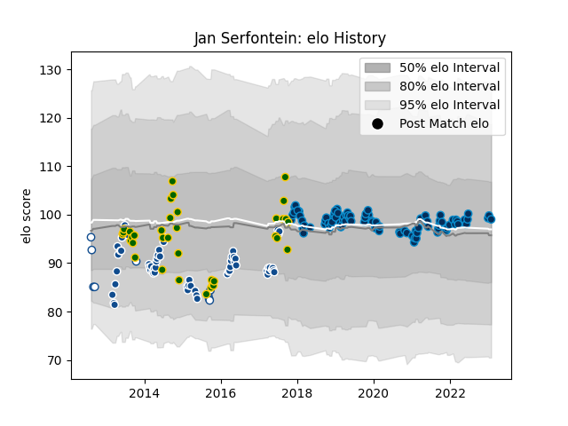

---  
layout: page  
title: Jan Serfontein  
date: 2023-02-02 18:48:54.243715  
categories: player  
---
# Jan Serfontein

## Positions: C

## Country: South Africa

## Current elo: 99.0

## Current Percentile: 59.0

# Elo History

# Match History

| Team                |   Appearances |   Win Rate |
|:--------------------|--------------:|-----------:|
| Montpellier Herault |            93 |   0.532258 |
| Bulls               |            60 |   0.516667 |
| South Africa        |            36 |   0.722222 |
| Blue Bulls          |             9 |   0.333333 |

| Opponent                 |   Matches |   Win Rate |
|:-------------------------|----------:|-----------:|
| Stade Toulousain         |        10 |   0.4      |
| Racing 92                |         8 |   0.375    |
| Clermont Auvergne        |         8 |   0.5      |
| Toulon                   |         8 |   0.75     |
| New Zealand              |         7 |   0.142857 |
| Argentina                |         7 |   1        |
| Sharks                   |         7 |   0.785714 |
| Australia                |         6 |   0.666667 |
| Pau                      |         6 |   0.333333 |
| Cheetahs                 |         6 |   0.833333 |
| Stormers                 |         5 |   0.4      |
| Lyon                     |         5 |   0        |
| Lions                    |         5 |   0.4      |
| La Rochelle              |         5 |   0.4      |
| Stade Francais Paris     |         5 |   0.8      |
| Southern Kings           |         4 |   0.75     |
| Agen                     |         4 |   0.75     |
| Bayonne                  |         4 |   0.5      |
| Wales                    |         4 |   0.75     |
| Western Force            |         4 |   0.75     |
| Castres Olympique        |         4 |   0.75     |
| Brumbies                 |         4 |   0.25     |
| Bordeaux Begles          |         4 |   0.75     |
| Sunwolves                |         3 |   0.666667 |
| Brive                    |         3 |   0.833333 |
| Blues                    |         3 |   0.333333 |
| Perpignan                |         3 |   0.666667 |
| Hurricanes               |         3 |   0        |
| New South Wales Waratahs |         3 |   0.333333 |
| Highlanders              |         3 |   0.333333 |
| Scotland                 |         3 |   1        |
| Chiefs                   |         3 |   0.166667 |
| Free State Cheetahs      |         3 |   0.333333 |
| France                   |         3 |   1        |
| Queensland Reds          |         2 |   0.5      |
| Newcastle Falcons        |         2 |   0.5      |
| Italy                    |         2 |   1        |
| Gloucester Rugby         |         2 |   0.5      |
| Grenoble                 |         2 |   0.5      |
| Connacht                 |         2 |   0.5      |
| Crusaders                |         2 |   0        |
| Edinburgh                |         2 |   0.5      |
| Glasgow Warriors         |         2 |   1        |
| Melbourne Rebels         |         2 |   1        |
| Western Province         |         2 |   0        |
| Griquas                  |         2 |   0.5      |
| Samoa                    |         1 |   1        |
| Golden Lions             |         1 |   0        |
| Ireland                  |         1 |   0        |
| Exeter Chiefs            |         1 |   0        |
| England                  |         1 |   1        |
| Jaguares                 |         1 |   1        |
| Leinster                 |         1 |   0        |
| United States of America |         1 |   1        |
| Oyonnax                  |         1 |   1        |
| Biarritz Olympique       |         1 |   1        |
| Natal Sharks             |         1 |   1        |