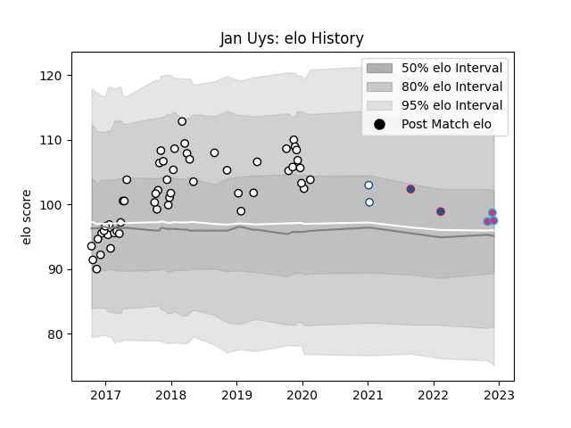

---  
layout: page  
title: Jan Uys  
date: 2023-02-02 18:50:03.141339  
categories: player  
---
# Jan Uys

## Positions: L

## Current elo: 111.0

## Current Percentile: 81.0

# Elo History

# Match History

| Team       |   Appearances |   Win Rate |
|:-----------|--------------:|-----------:|
| Brive      |            63 |   0.460317 |
| Zebre      |             8 |   0        |
| Grenoble   |             6 |   0.166667 |
| Blue Bulls |             2 |   0.5      |

| Opponent             |   Matches |   Win Rate |
|:---------------------|----------:|-----------:|
| Oyonnax              |         5 |   0.6      |
| Toulon               |         5 |   0.4      |
| Worcester Warriors   |         4 |   0.75     |
| Castres Olympique    |         4 |   0.25     |
| Stade Francais Paris |         4 |   0.75     |
| Dragons              |         3 |   0.333333 |
| Bayonne              |         3 |   0.5      |
| Pau                  |         3 |   0.333333 |
| Racing 92            |         3 |   0        |
| Bordeaux Begles      |         3 |   0.666667 |
| Bristol Rugby        |         3 |   0        |
| Montpellier Herault  |         3 |   0.666667 |
| La Rochelle          |         2 |   0        |
| Stade Toulousain     |         2 |   0.5      |
| Aurillac             |         2 |   0        |
| Lyon                 |         2 |   0.5      |
| Agen                 |         2 |   0        |
| Connacht             |         2 |   0        |
| Vannes               |         2 |   1        |
| Biarritz Olympique   |         2 |   0.75     |
| Beziers              |         2 |   0        |
| Benetton Treviso     |         2 |   0        |
| Provence Rugby       |         2 |   0.5      |
| US Bressane          |         1 |   1        |
| RC Enisei            |         1 |   1        |
| Ulster               |         1 |   0        |
| Mont-de-Marsan       |         1 |   1        |
| Pumas                |         1 |   0        |
| Ospreys              |         1 |   0        |
| Newcastle Falcons    |         1 |   0        |
| Montauban            |         1 |   0        |
| Golden Lions         |         1 |   1        |
| Glasgow Warriors     |         1 |   0        |
| Colomiers            |         1 |   0        |
| Clermont Auvergne    |         1 |   1        |
| Carcassonne          |         1 |   0        |
| Zebre                |         1 |   0        |