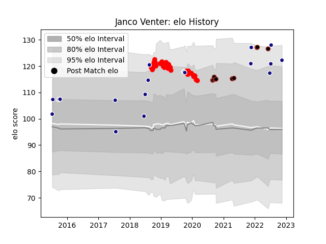

---  
layout: page  
title: Janco Venter  
date: 2023-03-11 00:13:14.815637  
categories: player  
---
# Janco Venter

## Positions: N8, FL

## Country: Namibia

## Current elo: 122.0

## Current Percentile: 94.0

# Elo History

# Match History

| Team     |   Appearances |   Win Rate |
|:---------|--------------:|-----------:|
| Jersey   |            32 |       0.5  |
| Namibia  |            20 |       0.6  |
| Saracens |            10 |       0.55 |

| Opponent            |   Matches |   Win Rate |
|:--------------------|----------:|-----------:|
| Zimbabwe            |         4 |   1        |
| Bedford             |         4 |   0.5      |
| Doncaster           |         4 |   0.75     |
| Nottingham          |         4 |   0.75     |
| London Scottish     |         3 |   0        |
| Cornish Pirates     |         3 |   0.666667 |
| Hartpury College    |         3 |   0.666667 |
| Kenya               |         3 |   1        |
| London Irish        |         3 |   0.666667 |
| Uganda              |         2 |   1        |
| Russia              |         2 |   1        |
| Richmond            |         2 |   1        |
| Newcastle Falcons   |         2 |   0        |
| New Zealand         |         2 |   0        |
| Italy               |         2 |   0        |
| Gloucester Rugby    |         2 |   0.5      |
| Ealing Trailfinders |         2 |   0        |
| Coventry            |         2 |   0        |
| Yorkshire Carnegie  |         2 |   1        |
| Wasps               |         1 |   0        |
| Spain               |         1 |   0        |
| Worcester Warriors  |         1 |   0        |
| Tonga               |         1 |   0        |
| Ampthill            |         1 |   1        |
| South Africa        |         1 |   0        |
| Sale Sharks         |         1 |   0        |
| Argentina           |         1 |   0        |
| Exeter Chiefs       |         1 |   1        |
| Bath Rugby          |         1 |   0.5      |
| Morocco             |         1 |   1        |