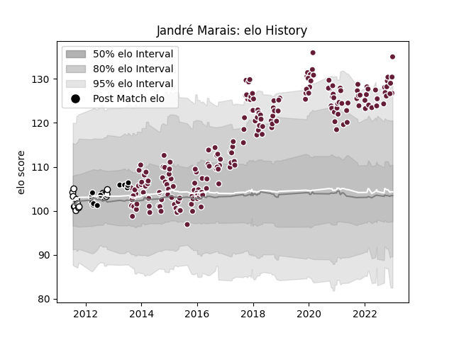

---  
layout: page  
title: Jandré Marais  
date: 2023-02-02 18:47:51.298343  
categories: player  
---
# Jandré Marais

## Positions: L

## Current elo: 131.0

## Current Percentile: 96.0

# Elo History

# Match History

| Team            |   Appearances |   Win Rate |
|:----------------|--------------:|-----------:|
| Bordeaux Begles |           197 |   0.581218 |
| Natal Sharks    |            19 |   0.684211 |
| Sharks          |            13 |   0.615385 |

| Opponent                 |   Matches |   Win Rate |
|:-------------------------|----------:|-----------:|
| Castres Olympique        |        16 |   0.53125  |
| Brive                    |        14 |   0.678571 |
| Montpellier Herault      |        14 |   0.464286 |
| Stade Toulousain         |        13 |   0.269231 |
| Racing 92                |        13 |   0.461538 |
| Toulon                   |        12 |   0.5      |
| Stade Francais Paris     |        12 |   0.416667 |
| La Rochelle              |        12 |   0.5      |
| Clermont Auvergne        |        11 |   0.727273 |
| Lyon                     |        11 |   0.818182 |
| Bayonne                  |        10 |   0.7      |
| Pau                      |        10 |   0.8      |
| Agen                     |         8 |   0.875    |
| Grenoble                 |         7 |   0.714286 |
| Oyonnax                  |         7 |   0.571429 |
| Perpignan                |         5 |   0.4      |
| Western Province         |         4 |   0.75     |
| Edinburgh                |         4 |   0.625    |
| Free State Cheetahs      |         4 |   0.75     |
| Blue Bulls               |         3 |   1        |
| Golden Lions             |         3 |   0.333333 |
| Bulls                    |         3 |   0.333333 |
| Griquas                  |         3 |   0.333333 |
| Exeter Chiefs            |         2 |   0.5      |
| Biarritz Olympique       |         2 |   1        |
| Wasps                    |         2 |   1        |
| Blues                    |         2 |   1        |
| Ulster                   |         1 |   1        |
| Queensland Reds          |         1 |   1        |
| Southern Kings           |         1 |   1        |
| Sharks                   |         1 |   0        |
| Scarlets                 |         1 |   1        |
| Sale Sharks              |         1 |   1        |
| Bristol Rugby            |         1 |   0        |
| RC Enisei                |         1 |   1        |
| Gloucester Rugby         |         1 |   0        |
| Pumas                    |         1 |   1        |
| Brumbies                 |         1 |   1        |
| Cheetahs                 |         1 |   1        |
| Ospreys                  |         1 |   1        |
| Newcastle Falcons        |         1 |   0        |
| New South Wales Waratahs |         1 |   0        |
| Dragons                  |         1 |   0        |
| Melbourne Rebels         |         1 |   1        |
| London Welsh             |         1 |   1        |
| Bath Rugby               |         1 |   0        |
| Leopards                 |         1 |   1        |
| Hurricanes               |         1 |   0        |
| Lions                    |         1 |   0        |