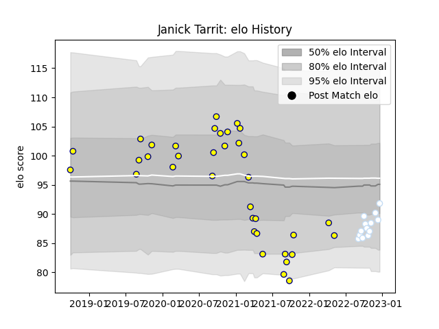

---  
layout: page  
title: Janick Tarrit  
date: 2022-12-18 16:18:40.545499  
categories: player  
---
# Janick Tarrit

## Positions: H

## Current elo: 92.0

## Current Percentile: 15.0

# Elo History

# Match History

| Team      |   Appearances |   Win Rate |
|:----------|--------------:|-----------:|
| Nevers    |            36 |   0.569444 |
| Racing 92 |            13 |   0.538462 |

| Opponent                   |   Matches |   Win Rate |
|:---------------------------|----------:|-----------:|
| Provence Rugby             |         5 |   0.4      |
| Soyaux-Angouleme           |         4 |   0.625    |
| Carcassonne                |         4 |   0.75     |
| Montauban                  |         3 |   0.666667 |
| Beziers                    |         3 |   0.666667 |
| Biarritz Olympique         |         3 |   0.666667 |
| Grenoble                   |         3 |   0        |
| Perpignan                  |         2 |   0.5      |
| Oyonnax                    |         2 |   0.5      |
| Agen                       |         1 |   0        |
| Valence Romans Drome Rugby |         1 |   1        |
| Stade Toulousain           |         1 |   0        |
| Rouen                      |         1 |   0        |
| Pau                        |         1 |   1        |
| Narbonne                   |         1 |   1        |
| Montpellier Herault        |         1 |   1        |
| Leinster                   |         1 |   0        |
| Mont-de-Marsan             |         1 |   1        |
| Lyon                       |         1 |   1        |
| Aurillac                   |         1 |   1        |
| La Rochelle                |         1 |   0        |
| Harlequins                 |         1 |   0        |
| Colomiers                  |         1 |   1        |
| Clermont Auvergne          |         1 |   1        |
| Castres Olympique          |         1 |   1        |
| Brive                      |         1 |   1        |
| Bordeaux Begles            |         1 |   0        |
| Bayonne                    |         1 |   0        |
| Vannes                     |         1 |   1        |