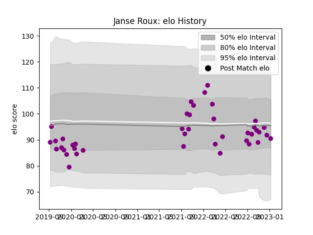

---  
layout: page  
title: Janse Roux  
date: 2023-01-13 11:29:30.322270  
categories: player  
---
# Janse Roux

## Positions: L

## Current elo: 90.0

## Current Percentile: 38.0

# Elo History

# Match History

| Team             |   Appearances |   Win Rate |
|:-----------------|--------------:|-----------:|
| Soyaux-Angouleme |            41 |    0.45122 |

| Opponent                   |   Matches |   Win Rate |
|:---------------------------|----------:|-----------:|
| Vannes                     |         3 |   0.666667 |
| Dax                        |         2 |   0.5      |
| Tarbes                     |         2 |   0.5      |
| Rouen                      |         2 |   0.5      |
| Perpignan                  |         2 |   0        |
| Oyonnax                    |         2 |   0        |
| Nevers                     |         2 |   0        |
| Montauban                  |         2 |   0.5      |
| Mont-de-Marsan             |         2 |   0.5      |
| Massy                      |         2 |   0.5      |
| Grenoble                   |         2 |   0        |
| Colomiers                  |         2 |   0.5      |
| Cognac Saint Jean d'Angély |         2 |   1        |
| Chambery                   |         2 |   0        |
| Carcassonne                |         2 |   0.75     |
| Beziers                    |         2 |   0.5      |
| Dijon                      |         1 |   0        |
| Albi                       |         1 |   1        |
| Nice                       |         1 |   1        |
| Blagnac                    |         1 |   1        |
| Biarritz Olympique         |         1 |   0        |
| Suresnes                   |         1 |   1        |
| Aurillac                   |         1 |   0        |
| Agen                       |         1 |   1        |