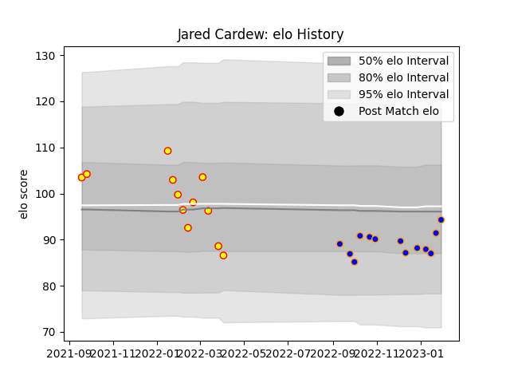

---  
layout: page  
title: Jared Cardew  
date: 2022-12-18 16:39:12.172557  
categories: player  
---
# Jared Cardew

## Positions: FL

## Current elo: 89.0

## Current Percentile: 37.0

# Elo History

# Match History

| Team      |   Appearances |   Win Rate |
|:----------|--------------:|-----------:|
| Richmond  |            11 |   0.409091 |
| Doncaster |             8 |   0.5      |

| Opponent            |   Matches |   Win Rate |
|:--------------------|----------:|-----------:|
| Ampthill            |         2 |       0.5  |
| Bedford             |         2 |       1    |
| Cornish Pirates     |         2 |       0.25 |
| Coventry            |         2 |       0    |
| Ealing Trailfinders |         2 |       0    |
| Jersey              |         2 |       0    |
| London Scottish     |         2 |       1    |
| Nottingham          |         2 |       0.5  |
| Doncaster           |         1 |       0    |
| Hartpury College    |         1 |       1    |
| Richmond            |         1 |       1    |