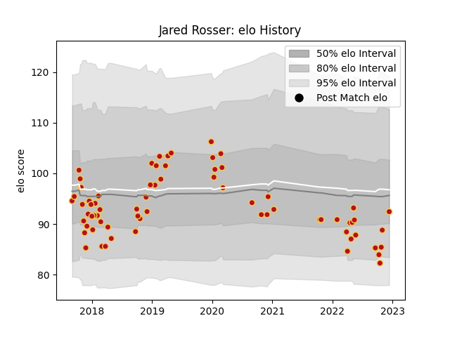

---  
layout: page  
title: Jared Rosser  
date: 2023-01-30 11:46:38.718573  
categories: player  
---
# Jared Rosser

## Positions: W

## Current elo: 72.0

## Current Percentile: 9.0

# Elo History

# Match History

| Team    |   Appearances |   Win Rate |
|:--------|--------------:|-----------:|
| Dragons |            70 |   0.292857 |

| Opponent           |   Matches |   Win Rate |
|:-------------------|----------:|-----------:|
| Ospreys            |         8 |   0.375    |
| Benetton Treviso   |         7 |   0.214286 |
| Scarlets           |         7 |   0.428571 |
| Cardiff Blues      |         7 |   0        |
| Glasgow Warriors   |         5 |   0.3      |
| Edinburgh          |         4 |   0.25     |
| RC Enisei          |         3 |   1        |
| Leinster           |         3 |   0        |
| Zebre              |         3 |   0.666667 |
| Lions              |         2 |   0.25     |
| Bordeaux Begles    |         2 |   0.5      |
| Newcastle Falcons  |         2 |   0        |
| Northampton Saints |         2 |   0        |
| Cheetahs           |         2 |   0.5      |
| Southern Kings     |         2 |   0.25     |
| Ulster             |         2 |   0.25     |
| Munster            |         2 |   0        |
| Connacht           |         1 |   1        |
| Clermont Auvergne  |         1 |   0        |
| Castres Olympique  |         1 |   0        |
| Bulls              |         1 |   0        |
| Sharks             |         1 |   0        |
| Stormers           |         1 |   0        |
| Worcester Warriors |         1 |   1        |