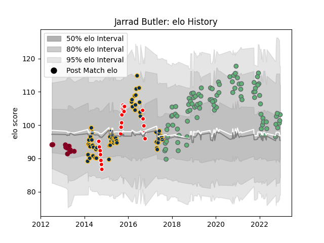

---  
layout: page  
title: Jarrad Butler  
date: 2022-12-14 11:25:10.391122  
categories: player  
---
# Jarrad Butler

## Positions: FL, N8

## Current elo: 103.0

## Current Percentile: 63.0

# Elo History

# Match History

| Team             |   Appearances |   Win Rate |
|:-----------------|--------------:|-----------:|
| Connacht         |            95 |   0.5      |
| Brumbies         |            59 |   0.576271 |
| Canberra Vikings |            22 |   0.590909 |
| Queensland Reds  |            15 |   0.666667 |

| Opponent                 |   Matches |   Win Rate |
|:-------------------------|----------:|-----------:|
| New South Wales Waratahs |        10 |   0.6      |
| Ulster                   |         9 |   0.555556 |
| Munster                  |         8 |   0.375    |
| Western Force            |         8 |   0.8125   |
| Melbourne Rebels         |         7 |   0.571429 |
| Cardiff Blues            |         7 |   0.428571 |
| Cheetahs                 |         7 |   0.571429 |
| Ospreys                  |         7 |   0.571429 |
| Queensland Reds          |         7 |   0.714286 |
| Scarlets                 |         6 |   0.5      |
| Leinster                 |         6 |   0.166667 |
| Benetton Treviso         |         6 |   1        |
| Edinburgh                |         6 |   0.166667 |
| Bulls                    |         6 |   0.666667 |
| Glasgow Warriors         |         6 |   0.166667 |
| Highlanders              |         5 |   0.6      |
| Hurricanes               |         5 |   0.4      |
| Southern Kings           |         5 |   1        |
| Stormers                 |         5 |   0.6      |
| Blues                    |         5 |   0.4      |
| Sharks                   |         4 |   0.5      |
| Chiefs                   |         4 |   0.75     |
| Melbourne Rising         |         4 |   0.5      |
| NSW Country Eagles       |         3 |   0.333333 |
| Queensland Country       |         3 |   1        |
| Zebre                    |         3 |   1        |
| Lions                    |         3 |   0.666667 |
| Greater Sydney Rams      |         3 |   1        |
| Brisbane City            |         3 |   0        |
| Dragons                  |         3 |   0.333333 |
| Gloucester Rugby         |         3 |   0.333333 |
| Crusaders                |         3 |   0        |
| Perth Spirit             |         2 |   0.5      |
| Leicester Tigers         |         2 |   0        |
| Stade Francais Paris     |         2 |   0.5      |
| Brumbies                 |         2 |   0.25     |
| Sydney Stars             |         2 |   0.75     |
| North Harbour Rays       |         2 |   0.75     |
| Worcester Warriors       |         2 |   0.75     |
| Jaguares                 |         1 |   1        |
| Sale Sharks              |         1 |   1        |
| Newcastle Falcons        |         1 |   1        |
| Stade Toulousain         |         1 |   0        |
| Sunwolves                |         1 |   1        |
| Bordeaux Begles          |         1 |   1        |
| Montpellier Herault      |         1 |   0        |