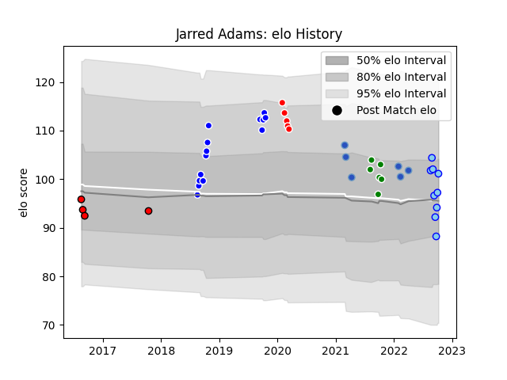

---  
layout: page  
title: Jarred Adams  
date: 2023-03-17 17:35:09.568704  
categories: player  
---
# Jarred Adams

## Positions: P

## Current elo: 101.0

## Current Percentile: 55.0

# Elo History

# Match History

| Team                 |   Appearances |   Win Rate |
|:---------------------|--------------:|-----------:|
| Auckland             |            14 |   0.857143 |
| Northland            |             9 |   0.555556 |
| Manawatu             |             6 |   0.666667 |
| Munakata Sanix Blues |             6 |   0.333333 |
| Sunwolves            |             5 |   0.2      |
| Counties Manukau     |             4 |   0.5      |

| Opponent                  |   Matches |   Win Rate |
|:--------------------------|----------:|-----------:|
| Tasman                    |         5 |   0.4      |
| Wellington                |         4 |   0.5      |
| Canterbury                |         4 |   0.25     |
| Southland                 |         4 |   1        |
| Counties Manukau          |         3 |   1        |
| North Harbour             |         3 |   0.333333 |
| Taranaki                  |         2 |   1        |
| Shimizu Blue Sharks       |         2 |   0.5      |
| Bay of Plenty             |         2 |   1        |
| Northland                 |         2 |   1        |
| Otago                     |         1 |   1        |
| Waikato                   |         1 |   1        |
| Toshiba Brave Lupus Tokyo |         1 |   0        |
| Tokyo Sungoliath          |         1 |   0        |
| Auckland                  |         1 |   1        |
| Melbourne Rebels          |         1 |   1        |
| Manawatu                  |         1 |   1        |
| Kyuden Voltex             |         1 |   1        |
| Hurricanes                |         1 |   0        |
| Crusaders                 |         1 |   0        |
| Chiefs                    |         1 |   0        |
| Brumbies                  |         1 |   0        |
| Mitsubishi Dynaboars      |         1 |   0        |