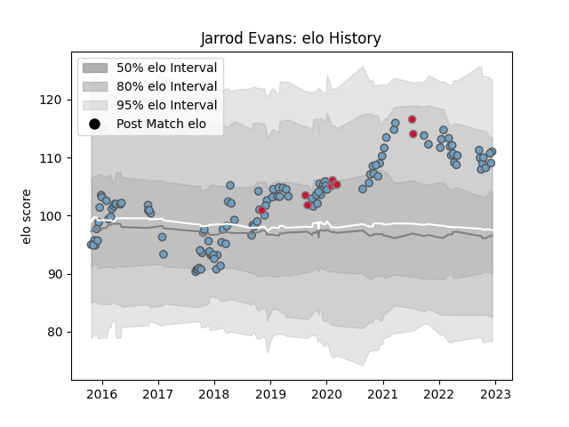

---  
layout: page  
title: Jarrod Evans  
date: 2023-02-02 18:44:28.916716  
categories: player  
---
# Jarrod Evans

## Positions: FH

## Country: Wales

## Current elo: 113.0

## Current Percentile: 82.0

# Elo History

# Match History

| Team          |   Appearances |   Win Rate |
|:--------------|--------------:|-----------:|
| Cardiff Blues |           121 |   0.520661 |
| Wales         |             9 |   0.388889 |

| Opponent            |   Matches |   Win Rate |
|:--------------------|----------:|-----------:|
| Scarlets            |        14 |  0.428571  |
| Glasgow Warriors    |        11 |  0.0909091 |
| Dragons             |         9 |  1         |
| Edinburgh           |         9 |  0.555556  |
| Benetton Treviso    |         7 |  0.714286  |
| Ulster              |         7 |  0.285714  |
| Munster             |         7 |  0.428571  |
| Connacht            |         6 |  0.833333  |
| Ospreys             |         6 |  0.166667  |
| Leinster            |         4 |  0.25      |
| Pau                 |         4 |  0.75      |
| Lyon                |         4 |  1         |
| Southern Kings      |         3 |  1         |
| Sale Sharks         |         3 |  0.333333  |
| Zebre               |         3 |  0.666667  |
| Ireland             |         2 |  0         |
| Newcastle Falcons   |         2 |  1         |
| Brive               |         2 |  0.5       |
| Stade Toulousain    |         2 |  1         |
| Calvisano           |         2 |  1         |
| England             |         2 |  0.5       |
| Cheetahs            |         2 |  1         |
| Montpellier Herault |         2 |  0.5       |
| Lions               |         2 |  0         |
| Harlequins          |         2 |  0         |
| Argentina           |         2 |  0.25      |
| France              |         1 |  0         |
| Exeter Chiefs       |         1 |  0         |
| Gloucester Rugby    |         1 |  1         |
| Italy               |         1 |  1         |
| Saracens            |         1 |  0         |
| Scotland            |         1 |  1         |
| Sharks              |         1 |  1         |
| Bulls               |         1 |  0         |
| Stormers            |         1 |  0         |
| Leicester Tigers    |         1 |  0         |
| Worcester Warriors  |         1 |  0         |