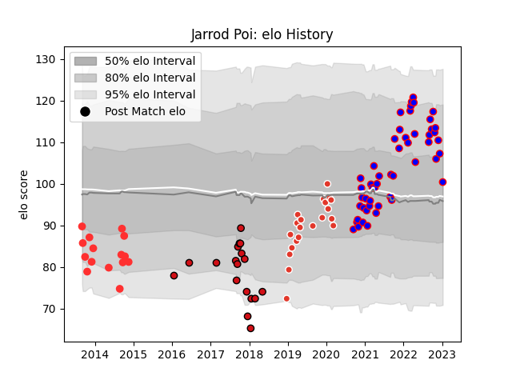

---  
layout: page  
title: Jarrod Poi  
date: 2022-12-14 11:31:05.397252  
categories: player  
---
# Jarrod Poi

## Positions: C

## Current elo: 88.0

## Current Percentile: 15.0

# Elo History

# Match History

| Team               |   Appearances |   Win Rate |
|:-------------------|--------------:|-----------:|
| Beziers            |            34 |   0.382353 |
| Stade Toulousain   |            18 |   0.5      |
| Tarbes             |            14 |   0.357143 |
| Biarritz Olympique |            12 |   0.5      |

| Opponent                   |   Matches |   Win Rate |
|:---------------------------|----------:|-----------:|
| Carcassonne                |         7 |   0.428571 |
| Agen                       |         5 |   0.6      |
| Aurillac                   |         5 |   0.4      |
| Perpignan                  |         5 |   0.4      |
| Mont-de-Marsan             |         5 |   0.2      |
| Colomiers                  |         5 |   0.4      |
| Oyonnax                    |         4 |   0.375    |
| Provence Rugby             |         4 |   0.25     |
| Brive                      |         2 |   0.5      |
| Cardiff Blues              |         2 |   0        |
| Bayonne                    |         2 |   0.5      |
| Sale Sharks                |         2 |   0.75     |
| Nevers                     |         2 |   0.5      |
| Montpellier Herault        |         2 |   0        |
| Montauban                  |         2 |   1        |
| Biarritz Olympique         |         2 |   0.5      |
| Soyaux-Angouleme           |         2 |   0.5      |
| Lyon                       |         2 |   0.5      |
| Grenoble                   |         2 |   0.5      |
| Rouen                      |         2 |   0.5      |
| Clermont Auvergne          |         2 |   0.5      |
| Stade Francais Paris       |         1 |   1        |
| Valence Romans Drome Rugby |         1 |   1        |
| US Bressane                |         1 |   0        |
| Toulon                     |         1 |   0        |
| Massy                      |         1 |   1        |
| Pau                        |         1 |   1        |
| Auch                       |         1 |   0        |
| La Rochelle                |         1 |   0        |
| Dax                        |         1 |   1        |
| Bourgoin-Jallieu           |         1 |   0        |
| Beziers                    |         1 |   0        |
| Vannes                     |         1 |   0        |