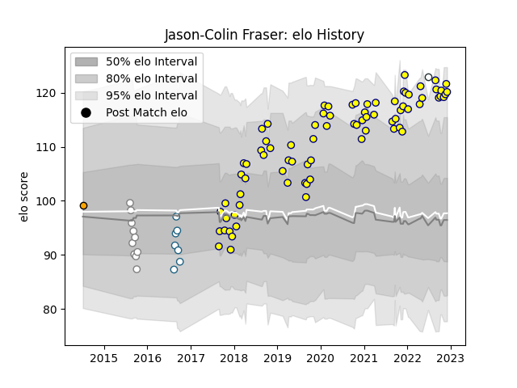

---  
layout: page  
title: Jason-Colin Fraser  
date: 2022-12-09 13:17:30.003685  
categories: player  
---
# Jason-Colin Fraser

## Positions: N8, FL

## Country: Zimbabwe

## Current elo: 120.0

## Current Percentile: 94.0

# Elo History

# Match History

| Team             |   Appearances |   Win Rate |
|:-----------------|--------------:|-----------:|
| Nevers           |            78 |   0.602564 |
| Pumas            |            10 |   0.35     |
| Griquas          |             7 |   0.571429 |
| Boland Cavaliers |             1 |   1        |
| Zimbabwe         |             1 |   1        |

| Opponent               |   Matches |   Win Rate |
|:-----------------------|----------:|-----------:|
| Mont-de-Marsan         |         7 |   0.714286 |
| Vannes                 |         7 |   0.428571 |
| Montauban              |         7 |   0.285714 |
| Soyaux-Angouleme       |         6 |   0.75     |
| Aurillac               |         6 |   0.666667 |
| Oyonnax                |         5 |   0.2      |
| Carcassonne            |         5 |   0.4      |
| Rouen                  |         4 |   1        |
| Beziers                |         4 |   0.5      |
| Provence Rugby         |         4 |   0.75     |
| US Bressane            |         3 |   1        |
| Biarritz Olympique     |         3 |   0.666667 |
| Colomiers              |         3 |   0.666667 |
| Eastern Province Kings |         3 |   1        |
| Golden Lions           |         3 |   0.333333 |
| Perpignan              |         3 |   0.666667 |
| Natal Sharks           |         3 |   0.333333 |
| Agen                   |         2 |   0.5      |
| Massy                  |         2 |   1        |
| Grenoble               |         2 |   1        |
| Free State Cheetahs    |         2 |   0.25     |
| Blue Bulls             |         2 |   0        |
| Bayonne                |         2 |   0.25     |
| Narbonne               |         1 |   1        |
| Netherlands            |         1 |   1        |
| Griquas                |         1 |   0        |
| Pumas                  |         1 |   1        |
| Brive                  |         1 |   0        |
| Roval Drome XV         |         1 |   1        |
| Boland Cavaliers       |         1 |   1        |
| Valke                  |         1 |   1        |
| Western Province       |         1 |   0        |