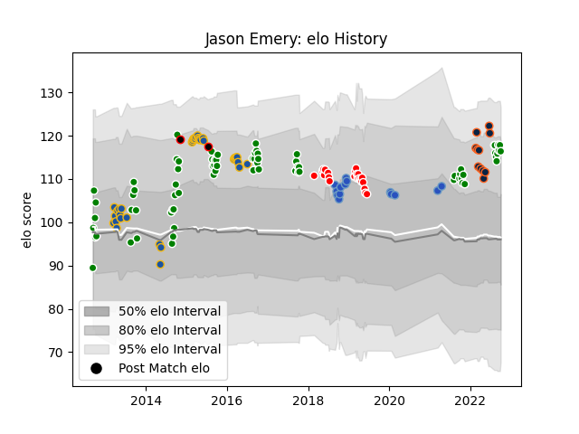

---  
layout: page  
title: Jason Emery  
date: 2023-03-21 18:51:40.591181  
categories: player  
---
# Jason Emery

Last updated: 2023-03-21
## Positions: C, FB

## Country: New Zealand Maori

## Current elo: 116.0

## Current Percentile: 88.0

# Elo History

# Match History

| Team                 |   Appearances |   Win Rate |
|:---------------------|--------------:|-----------:|
| Manawatu             |            73 |   0.410959 |
| Highlanders          |            35 |   0.485714 |
| Sunwolves            |            22 |   0.227273 |
| Munakata Sanix Blues |            14 |   0.214286 |
| R.U. New York        |            12 |   0.75     |
| Rugby New York       |            11 |   0.818182 |
| New Zealand Maori    |             2 |   1        |

| Opponent                         |   Matches |   Win Rate |
|:---------------------------------|----------:|-----------:|
| Hawke's Bay                      |         9 |   0.444444 |
| Southland                        |         8 |   0.75     |
| Queensland Reds                  |         7 |   0.285714 |
| Northland                        |         7 |   0.857143 |
| Otago                            |         7 |   0.285714 |
| Brumbies                         |         6 |   0        |
| North Harbour                    |         6 |   0.5      |
| Counties Manukau                 |         6 |   0.333333 |
| Taranaki                         |         6 |   0        |
| Hurricanes                       |         6 |   0.333333 |
| New England Free Jacks           |         5 |   0.2      |
| Melbourne Rebels                 |         5 |   0.2      |
| Waikato                          |         5 |   0.4      |
| New South Wales Waratahs         |         5 |   0.6      |
| Lions                            |         4 |   0.5      |
| Auckland                         |         4 |   0        |
| Seattle Seawolves                |         4 |   1        |
| Chiefs                           |         4 |   0.75     |
| Canterbury                       |         4 |   0.25     |
| Tasman                           |         4 |   0        |
| Wellington                       |         4 |   0.75     |
| Old Glory DC                     |         3 |   1        |
| Bay of Plenty                    |         3 |   0.333333 |
| Stormers                         |         3 |   0.666667 |
| Sharks                           |         3 |   0.666667 |
| NOLA Gold                        |         3 |   1        |
| Blues                            |         3 |   0.333333 |
| Crusaders                        |         3 |   0.333333 |
| Western Force                    |         2 |   0.5      |
| Hino Red Dolphins                |         2 |   0.5      |
| Rugby ATL                        |         2 |   1        |
| San Diego Legion                 |         2 |   1        |
| Toyota Verblitz                  |         2 |   0        |
| Green Rockets Tokatsu            |         2 |   0.5      |
| Southern Kings                   |         2 |   0.5      |
| Toyota Industries Shuttles Aichi |         2 |   0.5      |
| Bulls                            |         2 |   0.5      |
| Mie Honda Heat                   |         1 |   0        |
| Tokyo Sungoliath                 |         1 |   0        |
| Black Rams Tokyo                 |         1 |   0        |
| Urayasu D-Rocks                  |         1 |   0        |
| Toronto Arrows                   |         1 |   1        |
| Fiji                             |         1 |   1        |
| Dallas Jackals                   |         1 |   1        |
| L. A. Giltinis                   |         1 |   0        |
| Hanazono Kintetsu Liners         |         1 |   0        |
| Highlanders                      |         1 |   0        |
| Houston SaberCats                |         1 |   1        |
| Jaguares                         |         1 |   0        |
| Japan                            |         1 |   1        |
| Yokohama Canon Eagles            |         1 |   0        |