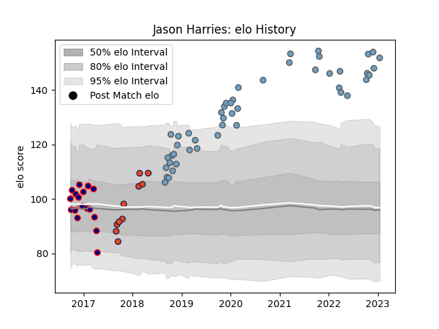

---  
layout: page  
title: Jason Harries  
date: 2023-02-02 18:41:25.474762  
categories: player  
---
# Jason Harries

## Positions: W

## Current elo: 140.0

## Current Percentile: 99.0

# Elo History

# Match History

| Team            |   Appearances |   Win Rate |
|:----------------|--------------:|-----------:|
| Cardiff Blues   |            49 |   0.510204 |
| London Scottish |            17 |   0.352941 |
| Edinburgh       |            10 |   0.8      |

| Opponent            |   Matches |   Win Rate |
|:--------------------|----------:|-----------:|
| Benetton Treviso    |         7 |   0.571429 |
| Dragons             |         5 |   1        |
| Edinburgh           |         5 |   0.4      |
| Scarlets            |         4 |   0.25     |
| Glasgow Warriors    |         4 |   0.5      |
| Ulster              |         3 |   0.333333 |
| Cheetahs            |         3 |   0.666667 |
| Connacht            |         3 |   0.333333 |
| Munster             |         3 |   0.666667 |
| Bedford             |         2 |   0.5      |
| Yorkshire Carnegie  |         2 |   0        |
| Stormers            |         2 |   0.5      |
| Southern Kings      |         2 |   1        |
| Sharks              |         2 |   1        |
| Richmond            |         2 |   0.5      |
| Ospreys             |         2 |   0.5      |
| London Irish        |         2 |   0.5      |
| Leinster            |         2 |   0        |
| Jersey              |         2 |   0.5      |
| Calvisano           |         2 |   1        |
| Cornish Pirates     |         2 |   0.5      |
| Ealing Trailfinders |         2 |   0.5      |
| Zebre               |         2 |   0.5      |
| Nottingham          |         1 |   0        |
| Newcastle Falcons   |         1 |   1        |
| London Welsh        |         1 |   0        |
| Saracens            |         1 |   0        |
| Doncaster           |         1 |   0        |
| Leicester Tigers    |         1 |   0        |
| Cardiff Blues       |         1 |   1        |
| Lyon                |         1 |   1        |
| Bulls               |         1 |   0        |
| Brive               |         1 |   0        |
| Rotherham Titans    |         1 |   1        |