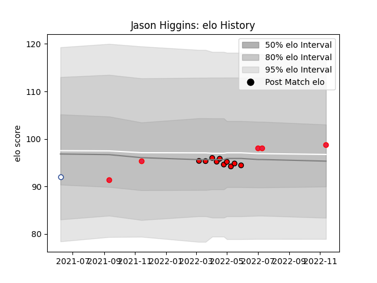

---  
layout: page  
title: Jason Higgins  
date: 2023-03-17 17:35:14.102264  
categories: player  
---
# Jason Higgins

## Positions: SH

## Country: Canada

## Current elo: 51.0

## Current Percentile: 1.0

# Elo History

# Match History

| Team             |   Appearances |   Win Rate |
|:-----------------|--------------:|-----------:|
| San Diego Legion |            13 |   0.384615 |
| Canada           |             7 |   0.428571 |
| Toronto Arrows   |             6 |   0.166667 |

| Opponent                 |   Matches |   Win Rate |
|:-------------------------|----------:|-----------:|
| L. A. Giltinis           |         3 |   0.333333 |
| Austin Gilgronis         |         2 |   0        |
| Belgium                  |         2 |   1        |
| Seattle Seawolves        |         2 |   0.5      |
| Rugby New York           |         2 |   0        |
| R.U. New York            |         2 |   0        |
| Utah Warriors            |         2 |   0.5      |
| Netherlands              |         1 |   1        |
| Old Glory DC             |         1 |   1        |
| Namibia                  |         1 |   0        |
| NOLA Gold                |         1 |   1        |
| Rugby ATL                |         1 |   0        |
| Houston SaberCats        |         1 |   0        |
| San Diego Legion         |         1 |   0        |
| Dallas Jackals           |         1 |   1        |
| Spain                    |         1 |   0        |
| United States of America |         1 |   0        |
| Portugal                 |         1 |   0        |