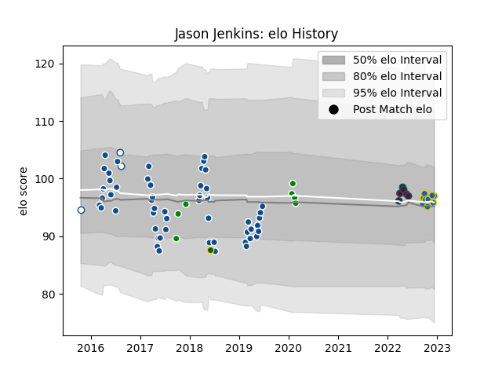

---  
layout: page  
title: Jason Jenkins  
date: 2022-12-09 13:12:21.998641  
categories: player  
---
# Jason Jenkins

## Positions: L

## Country: South Africa

## Current elo: 96.0

## Current Percentile: 54.0

# Elo History

# Match History

| Team            |   Appearances |   Win Rate |
|:----------------|--------------:|-----------:|
| Bulls           |            52 |   0.451923 |
| Leinster        |             8 |   1        |
| Toyota Verblitz |             7 |   0.714286 |
| Munster         |             6 |   0.5      |
| Blue Bulls      |             3 |   0.333333 |
| South Africa    |             1 |   0        |

| Opponent                          |   Matches |   Win Rate |
|:----------------------------------|----------:|-----------:|
| Sharks                            |         7 |   0.928571 |
| Stormers                          |         6 |   0.5      |
| Sunwolves                         |         5 |   0.6      |
| Jaguares                          |         5 |   0.4      |
| Ulster                            |         4 |   0.75     |
| Cheetahs                          |         4 |   0.75     |
| Lions                             |         3 |   0.333333 |
| Chiefs                            |         3 |   0        |
| Crusaders                         |         3 |   0        |
| Highlanders                       |         3 |   0.166667 |
| Melbourne Rebels                  |         3 |   1        |
| Leinster                          |         2 |   0        |
| Western Province                  |         2 |   0.5      |
| Southern Kings                    |         2 |   0.5      |
| Queensland Reds                   |         2 |   0.5      |
| Benetton Treviso                  |         2 |   1        |
| Hurricanes                        |         2 |   0        |
| Blues                             |         2 |   0.25     |
| Brumbies                          |         2 |   0        |
| Kubota Spears Funabashi Tokyo-Bay |         1 |   1        |
| Free State Cheetahs               |         1 |   0        |
| Wales                             |         1 |   0        |
| Tokyo Sungoliath                  |         1 |   0        |
| Cardiff Blues                     |         1 |   1        |
| Coca-Cola Red Sparks              |         1 |   1        |
| Glasgow Warriors                  |         1 |   1        |
| Black Rams Tokyo                  |         1 |   1        |
| Scarlets                          |         1 |   1        |
| Saitama Wild Knights              |         1 |   0        |
| Hino Red Dolphins                 |         1 |   1        |
| New South Wales Waratahs          |         1 |   0        |
| Munster                           |         1 |   1        |
| Mie Honda Heat                    |         1 |   1        |
| Zebre                             |         1 |   1        |