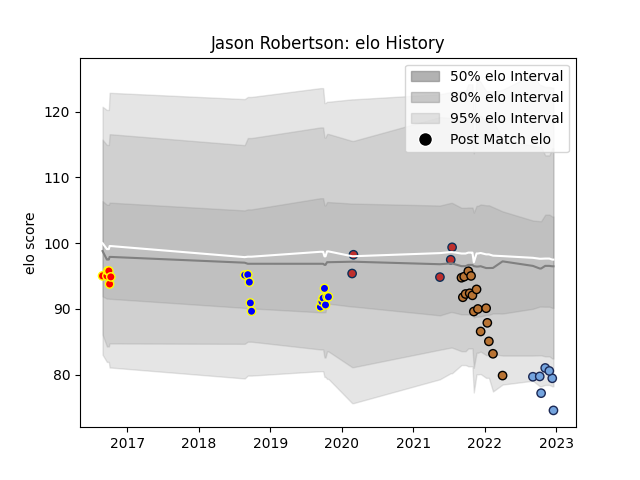

---  
layout: page  
title: Jason Robertson  
date: 2023-02-02 19:06:13.509452  
categories: player  
---
# Jason Robertson

## Positions: FH

## Current elo: 74.0

## Current Percentile: 6.0

# Elo History

# Match History

| Team          |   Appearances |   Win Rate |
|:--------------|--------------:|-----------:|
| Narbonne      |            18 |   0.166667 |
| Bay of Plenty |            12 |   0.666667 |
| Bayonne       |            11 |   0.318182 |
| Waikato       |             6 |   0.416667 |
| Old Glory DC  |             5 |   1        |

| Opponent            |   Matches |   Win Rate |
|:--------------------|----------:|-----------:|
| Hawke's Bay         |         4 |   0.75     |
| Manawatu            |         3 |   0.666667 |
| Counties Manukau    |         2 |   0.5      |
| Taranaki            |         2 |   0.75     |
| Scarlets            |         2 |   0        |
| Provence Rugby      |         2 |   1        |
| Northland           |         2 |   0.5      |
| North Harbour       |         2 |   0.5      |
| Aurillac            |         2 |   0        |
| Agen                |         2 |   0.5      |
| Beziers             |         2 |   0        |
| Bayonne             |         2 |   0        |
| Benetton Treviso    |         2 |   0        |
| Clermont Auvergne   |         1 |   1        |
| US Bressane         |         1 |   0        |
| Toulon              |         1 |   0        |
| Austin Gilgronis    |         1 |   1        |
| Southland           |         1 |   1        |
| Seattle Seawolves   |         1 |   1        |
| Austin Herd         |         1 |   1        |
| San Diego Legion    |         1 |   1        |
| Rouen               |         1 |   0        |
| Pau                 |         1 |   0.5      |
| Castres Olympique   |         1 |   0        |
| Nevers              |         1 |   0        |
| Montpellier Herault |         1 |   0        |
| Montauban           |         1 |   0        |
| Mont-de-Marsan      |         1 |   0        |
| Brive               |         1 |   1        |
| La Rochelle         |         1 |   1        |
| Houston SaberCats   |         1 |   1        |
| Canterbury          |         1 |   0        |
| Grenoble            |         1 |   0        |
| Carcassonne         |         1 |   0        |
| Colomiers           |         1 |   0        |
| Waikato             |         1 |   0        |