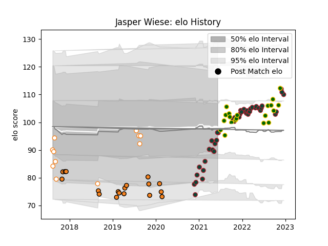

---  
layout: page  
title: Jasper Wiese  
date: 2023-03-21 18:14:31.477118  
categories: player  
---
# Jasper Wiese

Last updated: 2023-03-21
## Positions: N8

## Country: South Africa

## Current elo: 95.0

## Current Percentile: 21.0

# Elo History

# Match History

| Team                |   Appearances |   Win Rate |
|:--------------------|--------------:|-----------:|
| Leicester Tigers    |            53 |   0.726415 |
| South Africa        |            20 |   0.75     |
| Cheetahs            |            18 |   0.388889 |
| Free State Cheetahs |            12 |   0.583333 |

| Opponent                |   Matches |   Win Rate |
|:------------------------|----------:|-----------:|
| Connacht                |         6 |   0.5      |
| Northampton Saints      |         5 |   0.6      |
| Sale Sharks             |         5 |   0.2      |
| London Irish            |         4 |   0.75     |
| Harlequins              |         4 |   0.75     |
| Argentina               |         4 |   1        |
| Bristol Rugby           |         4 |   0.625    |
| Bath Rugby              |         4 |   0.75     |
| Worcester Warriors      |         4 |   1        |
| Scarlets                |         3 |   0.333333 |
| Wasps                   |         3 |   1        |
| Wales                   |         3 |   1        |
| New Zealand             |         3 |   0.666667 |
| Southern Kings          |         3 |   1        |
| Gloucester Rugby        |         3 |   1        |
| Western Province        |         3 |   0.333333 |
| Saracens                |         3 |   0.666667 |
| Australia               |         3 |   0.333333 |
| Blue Bulls              |         2 |   1        |
| Newcastle Falcons       |         2 |   1        |
| Natal Sharks            |         2 |   0        |
| Pumas                   |         2 |   1        |
| British and Irish Lions |         2 |   1        |
| Leinster                |         2 |   0        |
| Golden Lions            |         2 |   1        |
| Ospreys                 |         2 |   0        |
| Exeter Chiefs           |         2 |   0.5      |
| Ulster                  |         2 |   0.5      |
| Clermont Auvergne       |         2 |   1        |
| Scotland                |         1 |   1        |
| Italy                   |         1 |   1        |
| Munster                 |         1 |   0        |
| Montpellier Herault     |         1 |   0        |
| Ireland                 |         1 |   0        |
| Griquas                 |         1 |   0        |
| Georgia                 |         1 |   1        |
| England                 |         1 |   0        |
| Edinburgh               |         1 |   1        |
| Dragons                 |         1 |   1        |
| Cardiff Blues           |         1 |   0        |
| Brive                   |         1 |   1        |
| Bordeaux Begles         |         1 |   1        |
| Zebre                   |         1 |   1        |