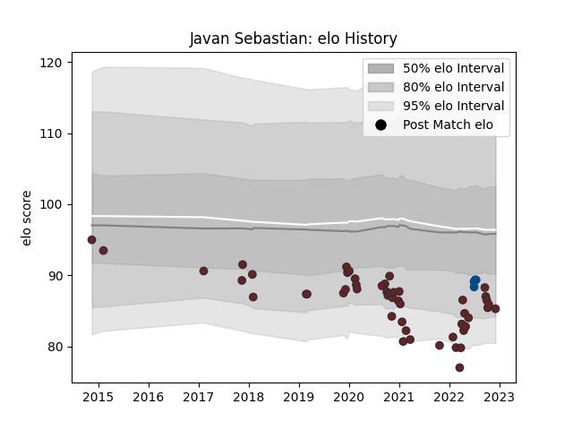

---  
layout: page  
title: Javan Sebastian  
date: 2022-12-09 13:18:19.342085  
categories: player  
---
# Javan Sebastian

## Positions: P

## Country: Scotland

## Current elo: 85.0

## Current Percentile: 12.0

# Elo History

# Match History

| Team     |   Appearances |   Win Rate |
|:---------|--------------:|-----------:|
| Scarlets |            50 |       0.41 |
| Scotland |             4 |       0.5  |

| Opponent           |   Matches |   Win Rate |
|:-------------------|----------:|-----------:|
| Cardiff Blues      |         7 |   0.428571 |
| Dragons            |         6 |   0.5      |
| Benetton Treviso   |         4 |   0.75     |
| Argentina          |         3 |   0.333333 |
| Ulster             |         3 |   0        |
| Ospreys            |         3 |   0.5      |
| Munster            |         3 |   0.333333 |
| Zebre              |         3 |   1        |
| Connacht           |         3 |   0.666667 |
| Edinburgh          |         2 |   0        |
| Bayonne            |         2 |   1        |
| Sale Sharks        |         2 |   0        |
| Toulon             |         2 |   0        |
| Exeter Chiefs      |         1 |   0        |
| Glasgow Warriors   |         1 |   0        |
| Leinster           |         1 |   0        |
| Lions              |         1 |   0        |
| Chile              |         1 |   1        |
| Northampton Saints |         1 |   0        |
| Cheetahs           |         1 |   1        |
| Southern Kings     |         1 |   1        |
| Stormers           |         1 |   0        |
| Bulls              |         1 |   0        |
| Harlequins         |         1 |   0        |