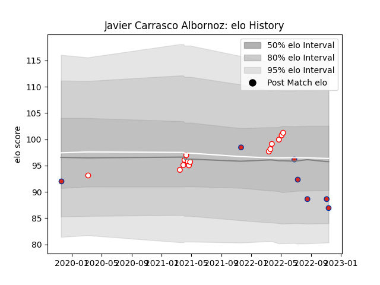

---  
layout: page  
title: Javier Carrasco Albornoz  
date: 2022-11-15 23:36:02.353101  
categories: player  
---
# Javier Carrasco Albornoz

## Positions: P

## Country: Chile

## Current elo: 87.0

## Current Percentile: 20.0

# Elo History

# Match History

| Team    |   Appearances |   Win Rate |
|:--------|--------------:|-----------:|
| Selknam |            14 |   0.714286 |
| Chile   |             7 |   0.285714 |

| Opponent                 |   Matches |   Win Rate |
|:-------------------------|----------:|-----------:|
| Cafeteros Pro            |         3 |   1        |
| Jaguares XV              |         3 |   0.666667 |
| Olimpia Lions            |         3 |   0.333333 |
| Penarol Rugby            |         3 |   0.666667 |
| Cobras                   |         2 |   1        |
| Brazil                   |         1 |   1        |
| Portugal                 |         1 |   0        |
| Romania                  |         1 |   0        |
| Russia                   |         1 |   1        |
| Scotland                 |         1 |   0        |
| Tonga                    |         1 |   0        |
| United States of America |         1 |   0        |