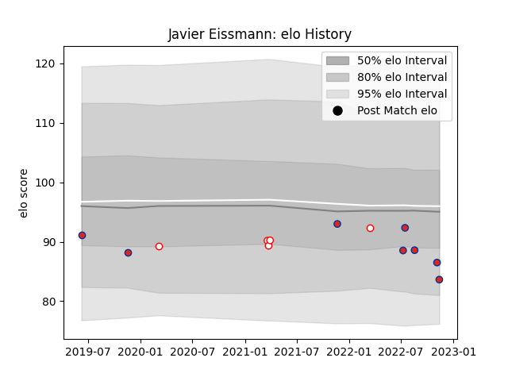

---  
layout: page  
title: Javier Eissmann  
date: 2023-03-17 17:34:21.658516  
categories: player  
---
# Javier Eissmann

## Positions: L

## Country: Chile

## Current elo: 96.0

## Current Percentile: 40.0

# Elo History

# Match History

| Team    |   Appearances |   Win Rate |
|:--------|--------------:|-----------:|
| Chile   |             9 |   0.333333 |
| Selknam |             5 |   0.4      |

| Opponent                 |   Matches |   Win Rate |
|:-------------------------|----------:|-----------:|
| Olimpia Lions            |         2 |        0.5 |
| Penarol Rugby            |         2 |        0.5 |
| Romania                  |         2 |        0   |
| United States of America |         2 |        0.5 |
| Brazil                   |         1 |        1   |
| Jaguares XV              |         1 |        0   |
| Portugal                 |         1 |        0   |
| Russia                   |         1 |        1   |
| Spain                    |         1 |        0   |
| Tonga                    |         1 |        0   |