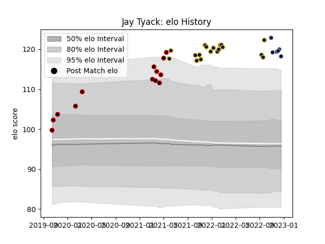

---  
layout: page  
title: Jay Tyack  
date: 2023-01-06 00:19:56.678688  
categories: player  
---
# Jay Tyack

## Positions: P

## Current elo: 98.0

## Current Percentile: 80.0

# Elo History

# Match History

| Team               |   Appearances |   Win Rate |
|:-------------------|--------------:|-----------:|
| Cornish Pirates    |            22 |   0.681818 |
| Worcester Warriors |            18 |   0.25     |
| Bristol Rugby      |             7 |   0.5      |

| Opponent            |   Matches |   Win Rate |
|:--------------------|----------:|-----------:|
| Newcastle Falcons   |         5 |   0.3      |
| Leicester Tigers    |         4 |   0.125    |
| Ampthill            |         3 |   0.666667 |
| Doncaster           |         3 |   0.666667 |
| Sale Sharks         |         3 |   0.333333 |
| Saracens            |         3 |   0.333333 |
| Ealing Trailfinders |         2 |   0.5      |
| Exeter Chiefs       |         2 |   0        |
| Coventry            |         2 |   0.5      |
| Hartpury College    |         2 |   1        |
| Bristol Rugby       |         2 |   0.5      |
| Bedford             |         2 |   1        |
| Northampton Saints  |         2 |   0        |
| Nottingham          |         2 |   1        |
| Harlequins          |         2 |   0.5      |
| Yorkshire Carnegie  |         1 |   1        |
| Wasps               |         1 |   1        |
| London Irish        |         1 |   0        |
| Richmond            |         1 |   1        |
| Perpignan           |         1 |   1        |
| London Scottish     |         1 |   0        |
| Bath Rugby          |         1 |   0        |
| Zebre               |         1 |   1        |