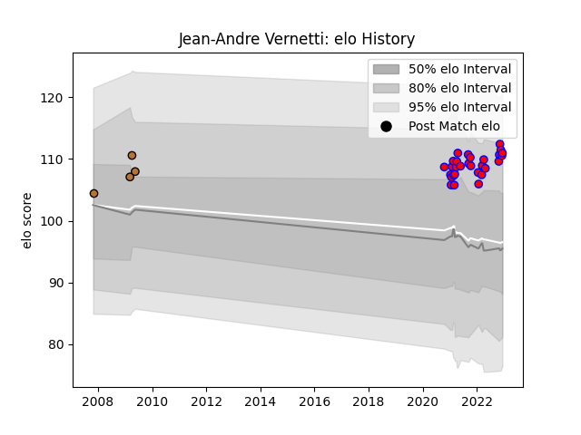

---  
layout: page  
title: Jean-Andre Vernetti  
date: 2023-01-15 11:50:27.014951  
categories: player  
---
# Jean-Andre Vernetti

## Positions: FB

## Current elo: 129.0

## Current Percentile: 92.0

# Elo History

# Match History

| Team     |   Appearances |   Win Rate |
|:---------|--------------:|-----------:|
| Blagnac  |            35 |   0.585714 |
| Narbonne |            10 |   0.2      |

| Opponent                   |   Matches |   Win Rate |
|:---------------------------|----------:|-----------:|
| Dax                        |         3 |   0.666667 |
| Aubenas                    |         3 |   0.666667 |
| Narbonne                   |         3 |   0.166667 |
| Massy                      |         3 |   0.666667 |
| Chambery                   |         3 |   0.666667 |
| Dijon                      |         2 |   0.5      |
| Pau                        |         2 |   0.5      |
| Albi                       |         2 |   0.5      |
| Valence Romans Drome Rugby |         2 |   1        |
| Cognac Saint Jean d'Angély |         2 |   0.5      |
| Suresnes                   |         2 |   1        |
| Bourgoin-Jallieu           |         2 |   0.5      |
| Tarbes                     |         2 |   0.5      |
| Nice                       |         2 |   0.5      |
| Oyonnax                    |         1 |   0        |
| Soyaux-Angouleme           |         1 |   0        |
| Rennes                     |         1 |   1        |
| US Bressane                |         1 |   0        |
| Agen                       |         1 |   0        |
| Lyon                       |         1 |   0        |
| La Rochelle                |         1 |   0        |
| Grenoble                   |         1 |   0        |
| Carqueiranne-Hyères        |         1 |   1        |
| Bordeaux Begles            |         1 |   0        |
| Beziers                    |         1 |   0        |
| Limoges                    |         1 |   1        |