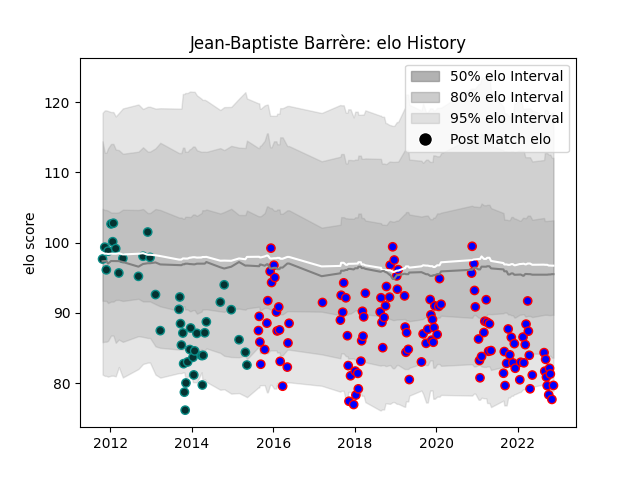

---  
layout: page  
title: Jean-Baptiste Barrère  
date: 2023-03-21 18:43:11.138250  
categories: player  
---
# Jean-Baptiste Barrère

Last updated: 2023-03-21
## Positions: FL

## Current elo: 73.0

## Current Percentile: 4.0

# Elo History

# Match History

| Team    |   Appearances |   Win Rate |
|:--------|--------------:|-----------:|
| Beziers |           153 |   0.54902  |
| Pau     |            62 |   0.637097 |

| Opponent                   |   Matches |   Win Rate |
|:---------------------------|----------:|-----------:|
| Carcassonne                |        17 |   0.470588 |
| Mont-de-Marsan             |        15 |   0.3      |
| Colomiers                  |        12 |   0.666667 |
| Montauban                  |        12 |   0.875    |
| Provence Rugby             |        11 |   0.636364 |
| Aurillac                   |        10 |   0.6      |
| Narbonne                   |         9 |   0.777778 |
| Grenoble                   |         9 |   0.333333 |
| Biarritz Olympique         |         8 |   0.5      |
| Oyonnax                    |         8 |   0.3125   |
| Albi                       |         8 |   0.6875   |
| Vannes                     |         8 |   0.375    |
| Bayonne                    |         7 |   0.571429 |
| Perpignan                  |         7 |   0.571429 |
| Dax                        |         7 |   0.714286 |
| Nevers                     |         7 |   0.428571 |
| Soyaux-Angouleme           |         6 |   0.333333 |
| US Bressane                |         6 |   0.5      |
| Agen                       |         6 |   0.666667 |
| Bourgoin-Jallieu           |         6 |   0.833333 |
| Massy                      |         6 |   0.833333 |
| Rouen                      |         5 |   0.8      |
| Tarbes                     |         5 |   0.6      |
| La Rochelle                |         4 |   0.25     |
| Beziers                    |         4 |   1        |
| Auch                       |         4 |   0.75     |
| Lyon                       |         3 |   0.333333 |
| Brive                      |         2 |   0.5      |
| Valence Romans Drome Rugby |         2 |   0.75     |
| Roval Drome XV             |         1 |   1        |