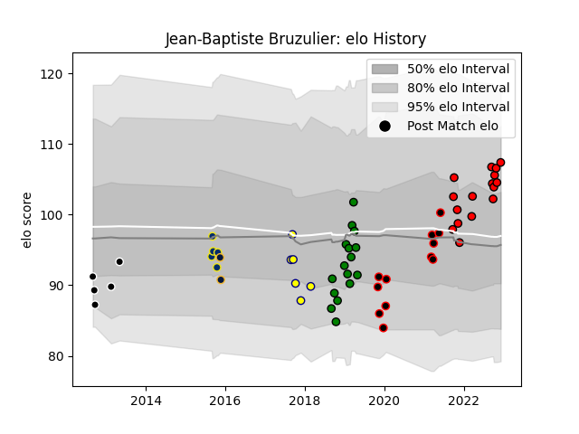

---  
layout: page  
title: Jean-Baptiste Bruzulier  
date: 2022-12-12 15:25:56.347991  
categories: player  
---
# Jean-Baptiste Bruzulier

## Positions: SH

## Current elo: 107.0

## Current Percentile: 77.0

# Elo History

# Match History

| Team               |   Appearances |   Win Rate |
|:-------------------|--------------:|-----------:|
| Hartpury College   |            16 |   0.25     |
| Yorkshire Carnegie |            16 |   0.625    |
| Cornish Pirates    |            12 |   0.75     |
| Nevers             |             6 |   0.333333 |
| Clermont Auvergne  |             5 |   0.7      |
| Provence Rugby     |             5 |   0        |
| Worcester Warriors |             2 |   0.5      |

| Opponent            |   Matches |   Win Rate |
|:--------------------|----------:|-----------:|
| Jersey              |         6 |   0.166667 |
| Doncaster           |         5 |   0.4      |
| Richmond            |         4 |   0.5      |
| Hartpury College    |         4 |   0.75     |
| Nottingham          |         4 |   0.75     |
| Bedford             |         4 |   0.5      |
| Cornish Pirates     |         3 |   0.666667 |
| Ealing Trailfinders |         3 |   0        |
| Vannes              |         2 |   0.5      |
| Coventry            |         2 |   0.5      |
| Beziers             |         2 |   0        |
| London Irish        |         2 |   0.5      |
| London Scottish     |         2 |   0.5      |
| Oyonnax             |         2 |   0.5      |
| Ampthill            |         2 |   1        |
| Tarbes              |         1 |   0        |
| Saracens            |         1 |   1        |
| Montpellier Herault |         1 |   0        |
| Yorkshire Carnegie  |         1 |   1        |
| Pau                 |         1 |   1        |
| La Rochelle         |         1 |   1        |
| Montauban           |         1 |   0        |
| Massy               |         1 |   1        |
| Aurillac            |         1 |   0        |
| Grenoble            |         1 |   1        |
| Caldy               |         1 |   1        |
| Brive               |         1 |   0        |
| Bordeaux Begles     |         1 |   0.5      |
| Biarritz Olympique  |         1 |   0        |
| Zebre               |         1 |   0        |