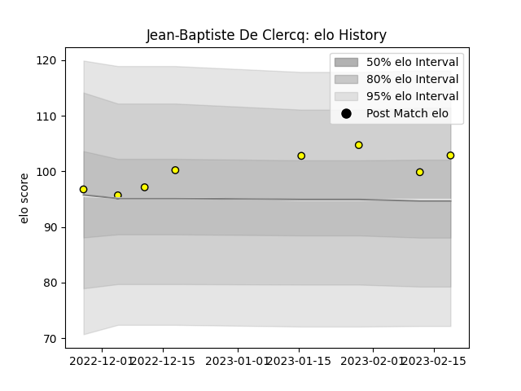

---  
layout: page  
title: Jean-Baptiste De Clercq  
date: 2023-03-17 17:16:47.958138  
categories: player  
---
# Jean-Baptiste De Clercq

## Positions: P

## Current elo: 105.0

## Current Percentile: 67.0

# Elo History

# Match History

| Team   |   Appearances |   Win Rate |
|:-------|--------------:|-----------:|
| Albi   |             7 |   0.785714 |

| Opponent         |   Matches |   Win Rate |
|:-----------------|----------:|-----------:|
| Blagnac          |         1 |        1   |
| Bourgoin-Jallieu |         1 |        0   |
| Dax              |         1 |        1   |
| Narbonne         |         1 |        1   |
| Nice             |         1 |        0.5 |
| Rennes           |         1 |        1   |
| Suresnes         |         1 |        1   |