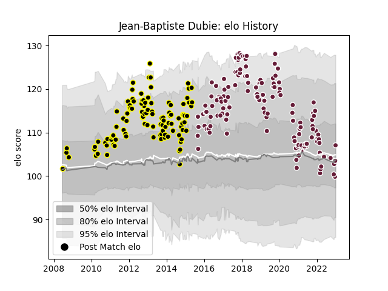

---  
layout: page  
title: Jean-Baptiste Dubie  
date: 2023-01-06 00:18:31.464187  
categories: player  
---
# Jean-Baptiste Dubie

## Positions: C, W

## Current elo: 107.0

## Current Percentile: 49.0

# Elo History

# Match History

| Team            |   Appearances |   Win Rate |
|:----------------|--------------:|-----------:|
| Bordeaux Begles |           136 |   0.492647 |
| Mont-de-Marsan  |           108 |   0.421296 |

| Opponent             |   Matches |   Win Rate |
|:---------------------|----------:|-----------:|
| Clermont Auvergne    |        18 |   0.416667 |
| Toulon               |        14 |   0.357143 |
| Pau                  |        12 |   0.5      |
| Racing 92            |        12 |   0.416667 |
| Stade Toulousain     |        12 |   0.166667 |
| Agen                 |        11 |   0.545455 |
| Stade Francais Paris |        11 |   0.545455 |
| Brive                |        11 |   0.590909 |
| Montpellier Herault  |        11 |   0.318182 |
| La Rochelle          |        10 |   0.4      |
| Lyon                 |         9 |   0.444444 |
| Castres Olympique    |         9 |   0.444444 |
| Aurillac             |         8 |   0.625    |
| Perpignan            |         8 |   0.4375   |
| Narbonne             |         7 |   0.714286 |
| Grenoble             |         7 |   0.428571 |
| Carcassonne          |         5 |   0.6      |
| Oyonnax              |         5 |   0.4      |
| Tarbes               |         5 |   0.4      |
| Bayonne              |         5 |   0.4      |
| Dax                  |         4 |   0.5      |
| Beziers              |         4 |   0.5      |
| Provence Rugby       |         4 |   0.5      |
| Albi                 |         4 |   1        |
| Auch                 |         3 |   0.666667 |
| Bourgoin-Jallieu     |         3 |   0.666667 |
| Bordeaux Begles      |         3 |   0        |
| Colomiers            |         3 |   0        |
| US Bressane          |         2 |   0.75     |
| Ulster               |         2 |   1        |
| Montauban            |         2 |   1        |
| Biarritz Olympique   |         2 |   0        |
| Edinburgh            |         2 |   1        |
| Newcastle Falcons    |         1 |   0        |
| Sale Sharks          |         1 |   0        |
| Bristol Rugby        |         1 |   0        |
| Connacht             |         1 |   0        |
| Exeter Chiefs        |         1 |   0        |
| Sharks               |         1 |   0        |
| Scarlets             |         1 |   1        |
| Saint-Etienne        |         1 |   1        |
| Ospreys              |         1 |   0        |
| Gloucester Rugby     |         1 |   0        |
| RC Enisei            |         1 |   1        |
| Périgueux            |         1 |   1        |
| Lannemezan           |         1 |   1        |
| Leicester Tigers     |         1 |   0        |
| Massy                |         1 |   1        |
| London Irish         |         1 |   0        |