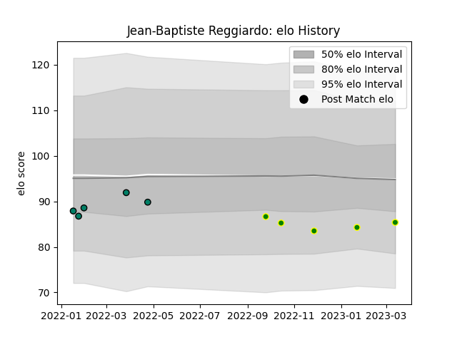

---  
layout: page  
title: Jean-Baptiste Reggiardo  
date: 2023-01-23 15:33:02.275113  
categories: player  
---
# Jean-Baptiste Reggiardo

## Positions: P

## Current elo: 85.0

## Current Percentile: 25.0

# Elo History

# Match History

| Team                |   Appearances |   Win Rate |
|:--------------------|--------------:|-----------:|
| Suresnes            |             5 |          0 |
| Carqueiranne-Hyères |             4 |          0 |

| Opponent                   |   Matches |   Win Rate |
|:---------------------------|----------:|-----------:|
| Dax                        |         2 |          0 |
| Albi                       |         1 |          0 |
| Aubenas                    |         1 |          0 |
| Bourgoin-Jallieu           |         1 |          0 |
| Chambery                   |         1 |          0 |
| Massy                      |         1 |          0 |
| US Bressane                |         1 |          0 |
| Valence Romans Drome Rugby |         1 |          0 |