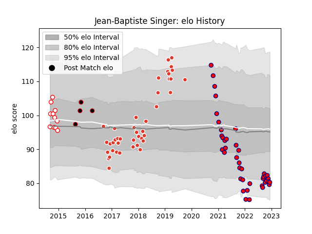

---  
layout: page  
title: Jean-Baptiste Singer  
date: 2023-03-21 18:06:35.831786  
categories: player  
---
# Jean-Baptiste Singer

Last updated: 2023-03-21
## Positions: L

## Current elo: 93.0

## Current Percentile: 50.0

# Elo History

# Match History

| Team               |   Appearances |   Win Rate |
|:-------------------|--------------:|-----------:|
| Aurillac           |            70 |   0.421429 |
| Biarritz Olympique |            66 |   0.55303  |
| Dax                |            17 |   0.323529 |
| Lyon               |            13 |   0.846154 |

| Opponent                   |   Matches |   Win Rate |
|:---------------------------|----------:|-----------:|
| Beziers                    |        12 |   0.666667 |
| Mont-de-Marsan             |        12 |   0.416667 |
| Vannes                     |        11 |   0.454545 |
| Carcassonne                |        11 |   0.545455 |
| Colomiers                  |        10 |   0.3      |
| Perpignan                  |         9 |   0.5      |
| Nevers                     |         8 |   0.125    |
| Grenoble                   |         8 |   0.3125   |
| Montauban                  |         8 |   0.625    |
| Provence Rugby             |         7 |   0.571429 |
| Narbonne                   |         7 |   0.857143 |
| Oyonnax                    |         7 |   0.428571 |
| Dax                        |         6 |   0.666667 |
| Soyaux-Angouleme           |         6 |   0.333333 |
| Rouen                      |         6 |   0.666667 |
| Aurillac                   |         5 |   0.6      |
| Bayonne                    |         5 |   0.6      |
| Bourgoin-Jallieu           |         5 |   0.7      |
| Agen                       |         4 |   0.5      |
| Albi                       |         4 |   0.5      |
| Biarritz Olympique         |         4 |   0        |
| Massy                      |         3 |   0.666667 |
| Tarbes                     |         3 |   0.666667 |
| US Bressane                |         3 |   0.666667 |
| Valence Romans Drome Rugby |         1 |   0        |
| Pau                        |         1 |   0        |