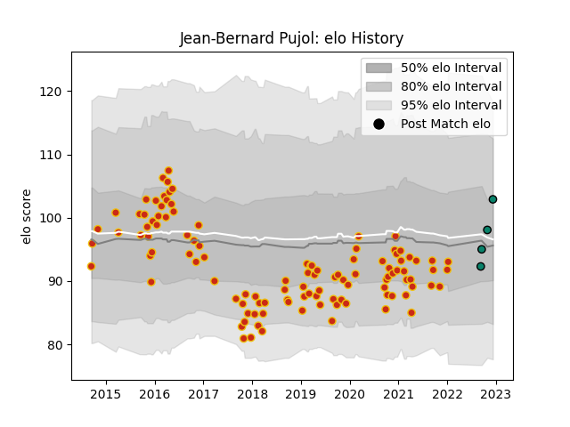

---  
layout: page  
title: Jean-Bernard Pujol  
date: 2022-12-14 11:33:27.400960  
categories: player  
---
# Jean-Bernard Pujol

## Positions: W

## Current elo: 103.0

## Current Percentile: 60.0

# Elo History

# Match History

| Team      |   Appearances |   Win Rate |
|:----------|--------------:|-----------:|
| Perpignan |           111 |   0.490991 |
| Montauban |             4 |   0.25     |

| Opponent                   |   Matches |   Win Rate |
|:---------------------------|----------:|-----------:|
| Biarritz Olympique         |        10 |   0.5      |
| Grenoble                   |         7 |   0.714286 |
| Montauban                  |         7 |   0.571429 |
| Mont-de-Marsan             |         6 |   0.333333 |
| Aurillac                   |         6 |   0.416667 |
| Beziers                    |         6 |   0.5      |
| Narbonne                   |         6 |   0.666667 |
| Carcassonne                |         5 |   0.6      |
| Lyon                       |         5 |   0.2      |
| Soyaux-Angouleme           |         4 |   0.875    |
| Provence Rugby             |         4 |   0.25     |
| Oyonnax                    |         4 |   0.5      |
| Agen                       |         4 |   0.5      |
| Colomiers                  |         4 |   0.375    |
| Dax                        |         3 |   0.333333 |
| Nevers                     |         3 |   0.666667 |
| Bourgoin-Jallieu           |         3 |   1        |
| Vannes                     |         3 |   1        |
| Albi                       |         2 |   0.5      |
| Bayonne                    |         2 |   0.5      |
| Valence Romans Drome Rugby |         2 |   1        |
| Stade Toulousain           |         2 |   0        |
| Rouen                      |         2 |   0.5      |
| Massy                      |         2 |   0.5      |
| Montpellier Herault        |         2 |   0.5      |
| Clermont Auvergne          |         1 |   0        |
| La Rochelle                |         1 |   0        |
| Bordeaux Begles            |         1 |   0        |
| Racing 92                  |         1 |   0        |
| Castres Olympique          |         1 |   0        |
| Sale Sharks                |         1 |   0        |
| Stade Francais Paris       |         1 |   0        |
| Brive                      |         1 |   0        |
| Tarbes                     |         1 |   0        |
| Toulon                     |         1 |   0        |
| Pau                        |         1 |   0        |