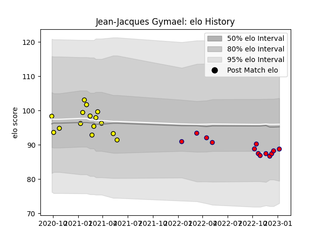

---  
layout: page  
title: Jean-Jacques Gymael  
date: 2022-12-14 11:35:12.800879  
categories: player  
---
# Jean-Jacques Gymael

## Positions: P

## Current elo: 92.0

## Current Percentile: 37.0

# Elo History

# Match History

| Team     |   Appearances |   Win Rate |
|:---------|--------------:|-----------:|
| Aurillac |             9 |   0.555556 |
| Albi     |             8 |   0.375    |

| Opponent                   |   Matches |   Win Rate |
|:---------------------------|----------:|-----------:|
| Carcassonne                |         2 |          0 |
| Dax                        |         2 |          1 |
| Agen                       |         1 |          0 |
| Beziers                    |         1 |          1 |
| Blagnac                    |         1 |          0 |
| Bourgoin-Jallieu           |         1 |          0 |
| Cognac Saint Jean d'Angély |         1 |          0 |
| Colomiers                  |         1 |          1 |
| Massy                      |         1 |          0 |
| Montauban                  |         1 |          1 |
| Nevers                     |         1 |          1 |
| Nice                       |         1 |          1 |
| Provence Rugby             |         1 |          0 |
| US Bressane                |         1 |          0 |
| Vannes                     |         1 |          1 |